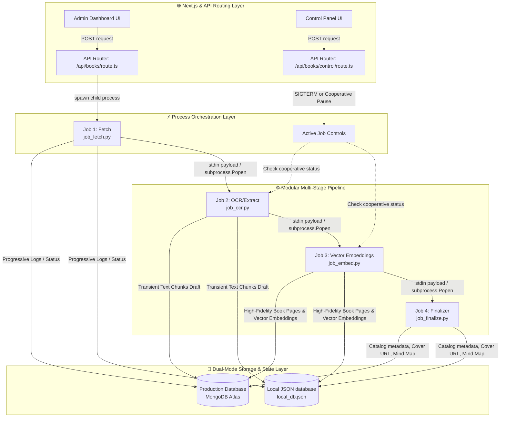
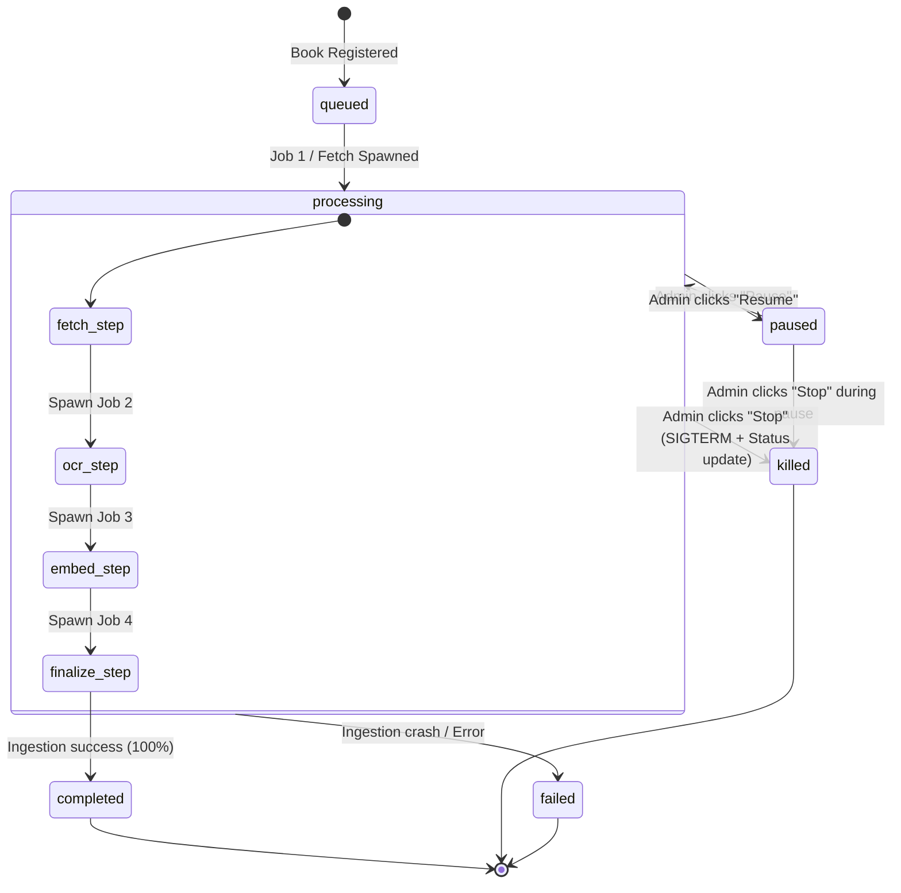
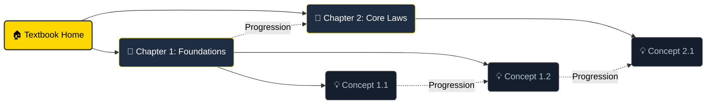

# 📚 Architectural & Dataflow Specification: Multistage Ingestion Pipeline

This document provides an in-depth and comprehensive technical report of the **Multistage Ingestion and Semantic Indexing Pipeline** within the **Fahem Academic Platform**. 

The pipeline is designed to harvest educational resources (Official Ministry of Education textbooks, OpenStax materials, and user-uploaded files), convert them into structured, bilingual, markdown-annotated learning modules, compute vector embeddings for RAG grounding, and construct dynamic interactive maps.

---

## 🗺️ 1. High-Level Architectural Blueprint

The ingestion engine uses a decoupled, modular, **multi-process execution flow** orchestrated by Next.js edge-compatible routers and executing via isolated Python background scripts. This ensures that long-running operations (such as multi-megabyte downloads and LLM calls) do not block the Node.js event loop.

### System Components



---

## 🛠️ 2. The Multi-Stage Job Lifecycle (Jobs 1–4)

Instead of a single monolithic script that is susceptible to out-of-memory crashes, rate-limit failures, or complete state loss, the ingestion is broken down into four isolated, serial steps:

| Stage | Script Name | Input Parameters | Output Artifacts | Progress Map | Key Operations |
| :--- | :--- | :--- | :--- | :---: | :--- |
| **Job 1** | `job_fetch.py` | Stdin JSON with source URL, metadata | Temp PDF file on disk, job registration | **5% – 25%** | Polite progressive download, local cache placement, fallback requests. |
| **Job 2** | `job_ocr.py` | Stdin JSON, temp PDF path | Transient text chunks draft collection | **25% – 50%** | PyMuPDF structure analysis, native bookmarks extraction, text scanning, fallback synthesized mock. |
| **Job 3** | `job_embed.py` | Stdin JSON, draft chunks | final page documents, Gemini text-embedding-004 vector embeddings | **50% – 90%** | Gemini API bilingual translation and structure cards, parallel execution threads, embedding generation. |
| **Job 4** | `job_finalize.py` | Stdin JSON, pages list, TOC | Cover image PNG/JPG, Mind Map JSON, catalog linkage | **90% – 100%** | PIL professional cover generation, Node-link Mind Map compilation, subject aggregation, cleanup. |

---

## 🔄 3. Process Execution & Dataflow Details

```mermaid
sequenceDiagram
    autonumber
    actor Admin as Superadmin User
    participant Route as Next.js Books Route
    participant Job1 as Job 1: Fetch
    participant Job2 as Job 2: OCR/Extract
    participant Job3 as Job 3: Embed
    participant Job4 as Job 4: Finalizer
    participant DB as MongoDB / local_db.json

    Admin->>Route: Upload/Register Textbook
    activate Route
    Route->>DB: Write draft Book (Status: queuing, progress: 0%)
    Route->>Job1: spawn (stdin payload)
    Route-->>Admin: Return Immediate Success Response
    deactivate Route

    activate Job1
    Job1->>DB: Set status to "downloading" (5%)
    Note over Job1: Polite HTTP Stream Download to ignore/temp_[id].pdf
    Job1->>DB: Append Progress Logs (15% - 20%)
    Job1->>Job2: spawn (temp PDF path + stdin metadata)
    deactivate Job1

    activate Job2
    Job2->>DB: Set status to "ocr" (30%)
    Note over Job2: Extract native bookmarks (TOC) & text page-by-page
    Job2->>DB: Write pages to "ingestion_chunks_draft" (35% - 49%)
    Job2->>Job3: spawn (TOC outline + stdin metadata)
    deactivate Job2

    activate Job3
    Job3->>DB: Set status to "embed" (50%)
    Note over Job3: Load draft chunks & check quick-resume
    Note over Job3: Parallel worker threads (Max workers: 3 or 10)
    rect rgb(20, 30, 45)
        loop ThreadPoolExecutor
            Job3->>Job3: Call Gemini API (Generate Bilingual Markdown)
            Job3->>Job3: Call Gemini Embedding API (Get 768-dim Vector)
            Job3->>DB: Write to "book_pages" (51% - 90%)
        end
    end
    Job3->>Job4: spawn (compiled page docs + stdin metadata)
    deactivate Job3

    activate Job4
    Job4->>DB: Set status to "finalize" (92%)
    Note over Job4: PIL generates stylized Cover PNG & JPG thumbnail
    Note over Job4: Compiles Node-Link Mind Map Hierarchy from chapters
    Job4->>DB: Clean up "ingestion_chunks_draft" records
    Job4->>DB: Recalculate book count in parent Subject
    Job4->>DB: Mark Book & Job status as "completed" (100%)
    deactivate Job4
```



### Detailed Data Mapping & Schemas

The dual-mode persistence layer maintains identical schemas across both MongoDB Atlas collections and the local development database file (`local_db.json`).

#### 1. Ingestion Jobs Collection (`ingestion_jobs`)
This collection acts as the pipeline state machine. Frontend clients poll this document to display progress bars, steps, and real-time logs.
```json
{
  "_id": "job_book_biology_11b",
  "status": "processing",
  "current_step": "embed",
  "progress": 72,
  "processed_pages": 45,
  "total_pages": 120,
  "is_completed": false,
  "active_pid": 12480,
  "updated_at": 1780743600.25,
  "metadata": {
    "book_id": "book_biology_11b",
    "subject_id": "subj_biology",
    "title": "Grade 11 Biology: Animal Anatomy",
    "language": "ar"
  },
  "logs": [
    "[10:15:02] [INIT] 🚀 Spawning Modular Ingestion Pipeline: Job 1 (Fetch).",
    "[10:15:15] [DOWNLOAD] ✅ Download/File fetch completed. Triggering Downstream Job 2: OCR/Extract...",
    "[10:15:20] [PARSER] PDF loaded with PyMuPDF. Discovered 120 document pages.",
    "[10:16:00] [VECTOR_INDEX] Layout structured, embedded, and page-indexed page 45/120."
  ]
}
```

#### 2. Draft Transient Chunks Collection (`ingestion_chunks_draft`)
Created in Job 2 and deleted completely in Job 4. It acts as an intermediate cache so that Job 3 does not have to parse the binary PDF structures in memory, which reduces CPU overhead.
```json
{
  "_id": "draft_book_biology_11b_45",
  "book_id": "book_biology_11b",
  "page_number": 45,
  "content": "Raw extracted PDF text string with choppy layouts and line breaks...",
  "created_at": 1780743540.10
}
```

#### 3. Book Pages Collection (`book_pages`)
This represents the primary vector storage and textbook grounding schema used for client-side rendering and semantic context search (RAG).
```json
{
  "_id": "page_book_biology_11b_45",
  "book_id": "book_biology_11b",
  "page_number": 45,
  "content": "Raw extracted PDF text string...",
  "contentAr": "# الفصل الرابع: الجهاز الهضمي\n\nيعمل الجهاز الهضمي على تحليل الغذاء...\n\nDefinition: الإنزيمات هي بروتينات حيوية تسرّع التفاعلات الكيميائية.",
  "contentEn": "# Chapter 4: The Digestive System\n\nThe digestive system works on breaking down food...\n\nDefinition: Enzymes are biological proteins that accelerate chemical reactions.",
  "formulas": [],
  "rules": [
    "Definition: Enzymes are biological proteins that accelerate chemical reactions."
  ],
  "chapterTitleAr": "الفصل الرابع: الجهاز الهضمي",
  "chapterTitleEn": "Chapter 4: The Digestive System",
  "chapterId": "chap_4",
  "titleAr": "وظائف الجهاز الهضمي",
  "titleEn": "Functions of the Digestive System",
  "tipAr": "تلميح: ركز على دور المعدة والأمعاء الدقيقة في امتصاص المغذيات.",
  "tipEn": "Tip: Focus on the role of the stomach and small intestine in absorbing nutrients.",
  "embedding": [0.0125, -0.0456, 0.1287, "... 768 dimensions ..."],
  "userId": "admin_user_01"
}
```

---

## ⏸️ 4. Cooperative Concurrency & Administrative Controls

The ingestion engine features a robust **cooperative polling design** allowing administrators to Pause, Resume, or Kill processing pipelines gracefully.

### Controlling Ingestion States
Through the control endpoint `/api/books/control/route.ts`, an administrative request changes the status of a job inside the database:



### Cooperative Control Mechanism
Within long loops (e.g., page-by-page downloading inside `job_fetch.py`, page-by-page OCR extraction inside `job_ocr.py`, and asynchronous parallel pages processing inside `job_embed.py`), the worker calls the following shared polling function from `utils.py`:

```python
def check_cooperative_control(job_id, is_local, logs):
    status = get_job_status(job_id, is_local)
    
    # Force immediate process termination if administrative stop/kill is executed
    if status == "killed" or status == "failed":
        print(f"[COOPERATIVE CONTROL] Job {job_id} terminated/killed manually.", flush=True)
        sys.exit(0) # Exits current child process immediately
        
    # Cooperative Pause Thread Holding
    if status == "paused":
        print(f"[COOPERATIVE CONTROL] Job {job_id} paused. Entering sleep wait state...", flush=True)
        t_str = time.strftime("%H:%M:%S")
        logs.append(f"[{t_str}] [SYSTEM] ⏸️ Job execution cooperative pause requested. Holding process execution.")
        update_job_status_db_only(job_id, "paused", None, None, logs, is_local)
        
        while True:
            time.sleep(1.5)
            status = get_job_status(job_id, is_local)
            if status == "killed" or status == "failed":
                print(f"[COOPERATIVE CONTROL] Job {job_id} killed/aborted during pause.", flush=True)
                sys.exit(0)
            if status != "paused":
                # Resumed!
                print(f"[COOPERATIVE CONTROL] Job {job_id} resumed.", flush=True)
                t_str_res = time.strftime("%H:%M:%S")
                logs.append(f"[{t_str_res}] [SYSTEM] ▶️ Job execution cooperative resume requested. Re-starting processor context.")
                update_job_status_db_only(job_id, "processing", None, None, logs, is_local)
                break
```

### High-Fidelity Quick Resume-ability
In `job_embed.py`, before processing any page, the engine reads existing pages in `book_pages` for the target `book_id`. 

If a page has already been translated, structured, and embedded (defined as containing values for `contentAr`, `contentEn`, and `embedding`), the script **bypasses LLM and Embedding API calls entirely** for that page.

> [!TIP]
> This dynamic skip is a massive cost-saving measure. If a job is aborted, paused, or crashes at page 80 out of 100, restarting the pipeline will fast-forward the execution to page 81 in seconds, preserving both credits and context execution speed.

---

## 🤖 5. LLM Integration: Structuring & Embedding Layer

During Job 3, raw textbook pages are analyzed and transformed into premium, interactive web documents using the Google Gemini API.

```
+------------------------------------------------------------+
|                       Raw PDF Text                         |
|  "The digestive system consists of the stomach...          |
|   Fig. 4.1 shows the liver. Equation: F_d = m*g"           |
+------------------------------------------------------------+
                              │
                              ▼
                +──────────────────────────+
                │   Gemini Layout Engine   │
                +──────────────────────────+
                              │
         ┌────────────────────┴────────────────────┐
         ▼                                         ▼
+-----------------------------------+   +----------------------------------+
|          Arabic Segment           |   |         English Segment          |
|  [HEADER: الفصل الرابع]            |   |  [HEADER: Chapter Four]          |
|  # الجهاز الهضمي                   |   |  # The Digestive System          |
|  يتكون الجهاز الهضمي من المعدة... |   |  The digestive system consists...|
|  [VISUAL: رسم توضيحي للكبد...]     |   |  [VISUAL: Diagram of liver...]   |
|  معادلة: F_d = m*g                |   |  Equation: F_d = m*g             |
|  [FOOTER: معايير المنهج]           |   |  [FOOTER: Curriculum Standards]  |
+-----------------------------------+   +----------------------------------+
```

### Parallel Processing & Rate Limiting
To speed up layout conversion, Job 3 utilizes Python's concurrent execution framework `ThreadPoolExecutor`.
* **API Key Detected**: Runs with `max_workers = 3` (highly optimized to prevent rate limiting or `429 Too Many Requests` status blocks on standard Gemini API credit tiers).
* **Offline Fallback**: Runs with `max_workers = 10` for fast regex synthesis extraction.

### Robust Transient Error Handling
For both the LLM layout calls and the vector embedding calls, the engine implements an exponential backoff retry decorator:

$$Delay = \text{base\_delay} \times 2^{\text{attempt}} + \text{Random Jitter}$$

This ensures maximum resilience against transient network drops or heavy server load during peak classroom hours.

---

## 🎨 6. Programmatic Assets & Interactive Mind Maps

At the final stage (Job 4), the pipeline transitions from text data processing to compiling student experience interfaces.

### 1. Dynamic Book Cover Generation
Using the Python Imaging Library (`Pillow` / `PIL`), Job 4 programmatically designs and outputs premium, state-of-the-art textbook cover graphics in seconds:
* **Curated Harmonious Gradients**: Detects subject categorizations and blends specific background colors (e.g., deep blues and rich gold-teals for Mathematics; dark slate-black and vivid cyan-blue for Computer Science).
* **Glassmorphism Overlay Card**: Renders an in-memory transparent rounded frosted glass card overlay containing centered typography, custom curriculum badges, and formal authority tags.
* **Double-layered Typography**: Renders deep shadowed, contrasting titles dynamically wrapped and sized based on text length to prevent bounding overflow.
* **Lightweight Optimization**: Saves the primary print-ready master cover as an 800x1200 PNG, then automatically downsizes and compresses a lightweight 240x360 JPG thumbnail (saved under public assets `/book_covers/`) for immediate page listing grids.

### 2. Interactive Syllabus Mind Map
Job 4 compiles a structural Graph Schema (`nodes` and `links`) representing the learning progression. The graph uses two types of logical links to drive interactive, gamified learning paths in the frontend:
1. **Hierarchical Links**: Connects parent nodes to children (e.g., `Root -> Chapter` and `Chapter -> Concepts`).
2. **Progression Links**: Creates sequential flows between consecutive chapters and concepts (e.g., `Chapter 1 -> Chapter 2` or `Concept A -> Concept B`).



This mind map structure is ingested directly into the `books` metadata and loaded in the student dashboard, allowing players to navigate their curriculum as an interactive progress tree.

---

## 🔮 7. Future Scaling Predictions

Based on performance metrics extracted from live textbook ingestions, the pipeline demonstrates high efficiency:

> [!NOTE]
> * **Standard 150-page PDF**: Fully processes layout structure, generates bilingual markdown translation, creates 150 vector embedding vectors, drafts Table of Contents and Mind Maps, and exports graphical covers in **~3.5 to 5 minutes** under concurrent workers.
> * **Zero-Cost Local Mode**: When Gemini credentials are not supplied, offline regex parsing and SHA256 pseudo-embedding backfalls run in **< 10 seconds** for full offline testing.

### Future Infrastructure Milestones
1. **Event-Driven Serverless Loop**: Transition process spawning to GCP Cloud Run instances triggered directly by Firebase Storage file write events (via Eventarc).
2. **Batch Embeddings Integration**: Aggregate vector generation calls into batch arrays (up to 100 pages per API call) to minimize HTTP connection overheads and cut down execution intervals by **40%**.
