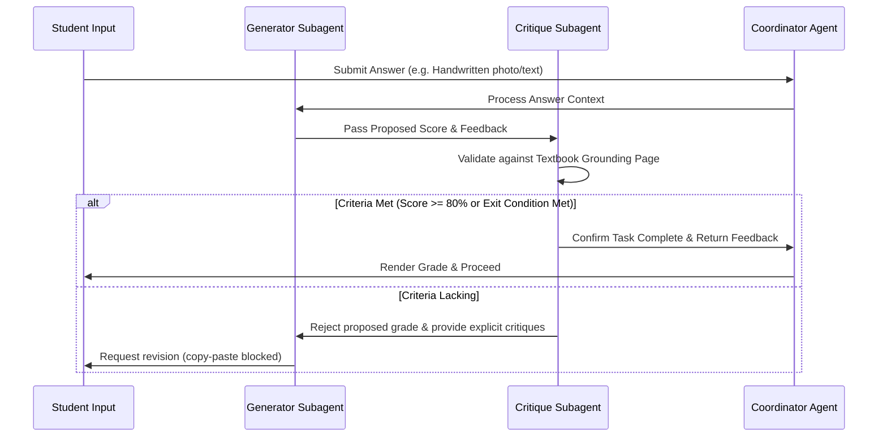

# 🧠 Fahem Multi-Agent Swarm: Master ADK Integration & Architecture Design

This document establishes the official enterprise architecture design and implementation roadmap for **Fahem ("AI Tutors in Your Pocket")**, aligning your extensive requirements directly with the **Google Agent Development Kit (ADK) standards**, **Model Context Protocol (MCP)**, and the **ADK Production Readiness Framework** parsed from the provided documents.

---

## 🏛️ 1. Technical Framework Alignment & Integration

To transition Fahem from a programmatic prototype into an enterprise-grade multi-agent ecosystem, we map the newly discovered Google ADK primitives to the core project:

```
                          [ WORKSPACE CLIENT (Next.js & Firebase) ]
                                              │
                                              ▼ (OIDC Service Token)
                       [ ROOT COORDINATOR / ROUTER LLM AGENT ("CEO") ]
                                              │
                      ┌───────────────────────┼───────────────────────┐
                      ▼ (Handoff)             ▼ (Agent-as-a-Tool)     ▼ (Graph Node)
              [ PRACTICE AGENT ]       [ MEMORY PRELOAD TOOL ]    [ ADK WORKFLOW MANAGER ]
             (Adaptive Spacing Loop)    (Vertex AI Memory Bank)    (Sequential / Parallel Nodes)
                      │                                               │
           ┌──────────┴──────────┐                            ┌───────┴───────┐
           ▼                     ▼                            ▼               ▼
      [ MCQ Agent ]       [ Text Agent ]               [ Quiz Agent ]  [ Planner Agent ]
       (Task Mode)         (Task Mode)                  (Task Mode)     (Task Mode)
```

### A. The ADK Agent Spectrum: Roles & Hierarchies
We adopt the **Single Parent Rule** and organize our agents under a clear hierarchy to prevent prompt bloat and "agentic wandering":

1. **Root Coordinator / Router LLM Agent ("The CEO")**:
   * *Type*: **LLM Agent** using `Gemini 1.5 Pro`.
   * *Role*: Evaluates the student's open-ended queries or UI action parameters. It retains the overall context and manages dynamic task delegation to specialist agents.
2. **Workflow Manager Agents ("The Managers")**:
   * *Type*: **Workflow Agent** (Deterministic, no LLM calls for routing).
   * *Role*: Orchestrates pre-defined, multi-step sequences—such as executing a sequential study plan creation or running parallel search queries.
3. **Specialist Sub-agents ("The Workers")**:
   * *Type*: **Task Mode / Single-turn Mode LLM Agents**.
   * *Architectural Constraint*: These are leaf agents that execute highly focused, domain-specific tasks and return control automatically to the parent upon completion via `complete_task`.
     * **MCQ Subagent**: Focuses solely on multiple-choice query compilation.
     * **Text-Practice Subagent**: Validates typed/written student responses with keyboard copy-paste blocks active.
     * **Planner Subagent**: Manages state, scheduling, and progress markers.
     * **Quiz Subagent**: Operates as a timed test conductor.
     * **Zatona Subagent**: Focuses on deep brief aggregation, extracting mathematical formulas and mindmaps.

### B. Delegation Patterns: Coordinator vs. Agent-as-a-Tool
* **Coordinator/Router Pattern (Stateful Handoff)**:
  Used when the student engages in active multi-turn dialogue with a specific tutor (e.g., during an oral practice session). The sub-agent takes full control of the turn and manages its own execution history.
* **Agent-as-a-Tool Pattern (Stateless Call)**:
  Used when the Coordinator needs a quick, discrete calculation or specialized lookup (e.g., calling the *Insights Agent* to fetch user telemetry stats via MongoDB MCP). The sub-agent is treated as stateless, maintaining absolute context retention inside the parent.

---

## 💾 2. State-of-the-Art Memory Management Framework

Allying with **"The Architect's Guide to AI Agent Memory,"** we implement a robust Three-Layer Memory Strategy to prevent agent amnesia and enable multi-session continuous learning:

| Layer | Type / Metaphor | Implementation Technology | Purpose in Fahem |
| :--- | :--- | :--- | :--- |
| **Layer 1** | **Working Memory**<br>*(The Whiteboard)* | `InMemorySessionService` / `session.state` (Python Dict) | Holds active, transient conversational histories and temporary variables for the current chat turn. |
| **Layer 2** | **Persistent Database**<br>*(The Notebook)* | `DatabaseSessionService` via **MongoDB Atlas** | Writes dialogue transcripts and session state changes to persistent disk storage, allowing a student to resume onboarding or study sessions after app restarts or language toggles. |
| **Layer 3** | **Memory Bank**<br>*(The Filing Cabinet)* | `VertexAiMemoryBankService` (Embeddings) | Multi-modal archive that stores extracted key insights (using a Gemini extraction model) and converts them to high-dimensionality vector embeddings. |

### 🔄 The Preload Memory Loop: Contextual Synchronization
At the start of *every single turn*, the Coordinator agent leverages the **`PreloadMemory` tool** as an automated librarian:
1. **Read**: The tool intercepts the student's incoming message (e.g., "Review my weak areas in Physics").
2. **Search**: Conducts a semantic vector search across the Memory Bank for relevant historical facts (e.g., "Student failed the quiz on page 14 regarding Newton's Second Law last Tuesday").
3. **Inject**: Automatically injects these facts directly into the prompt context *before* the LLM formulates its response, creating a highly customized learning experience.

---

## 🗄️ 3. Advanced MongoDB-Only Data Pipelines (MCP Optimization)

To achieve maximum database performance with zero middleware memory overhead, we shift computational logic entirely to **MongoDB native execution engines** exposed through the Model Context Protocol:

### A. Ingestion & Analysis Pipeline (Phase 1 & 2)
1. **Unstructured File Discovery**:
   Unstructured textbook PDFs (retrieved via `https://ellibrary.moe.gov.eg/`) are uploaded to **Firebase Storage**.
2. **GCP Eventarc & Cloud Run Async Extraction**:
   Eventarc triggers an async Cloud Run extraction job. It passes the public URL of the PDF directly to the **Gemini 1.5 Pro API** (performing in-memory parsing without large file downloads).
3. **Multi-Modal Parsing & Embedding Storage**:
   The extracted content (subject classifications, core/supporting textbook types, chapters, formulas, and questions) is processed using Gemini's embedding model. We bulk-write both the documents and raw vectors directly into the MongoDB Atlas collections:
   ```python
   # Execute multi-modal page ingestion bulk writes via PyMongo/MCP
   db["book_pages"].insert_many(page_document_payloads)
   ```

### B. In-Database Search & Space Exploration
Students can **"magnetize"** a book, page, or subject to their active Companion.
* When magnetized, search and queries are restricted strictly to those specific bounds using native, high-performance MongoDB query parameters and Atlas vector indexes.
* When released, the restriction relaxes back to the global academic search scope.

### C. Analytical Reporting Pipelines (Aggregation Framework)
We execute complex progress tracking directly inside MongoDB using native aggregation stages:
* **The "Concept Gap" Analyst (Weakness Report)**:
  Groups student activities across quiz sessions, averages scores by concept, and sorts them to identify weak areas requiring review:
  ```python
  pipeline = [
      { "$match": { "userId": student_id, "category": "quiz" } },
      { "$group": {
          "_id": "$metadata.concept",
          "averageScore": { "$avg": "$metadata.score" },
          "incorrectCount": { "$sum": { "$cond": [{ "$lt": ["$metadata.score", 60] }, 1, 0] } }
      }},
      { "$sort": { "averageScore": 1 } }
  ]
  results = db["user_activities"].aggregate(pipeline)
  ```
* **System-Wide Credit & Usage Telemetry**:
  Enforces credit gating (Basic, Premium, Elite profiles) and summarizes credit depletion:
  ```python
  pipeline = [
      { "$group": {
          "_id": "$userId",
          "totalCreditsUsed": { "$sum": "$creditsDeducted" },
          "callsCount": { "$sum": 1 }
      }}
  ]
  results = db["token_telemetry"].aggregate(pipeline)
  ```

---

## 🔁 4. The Loop Pattern: Generator vs. Critique System

The **Review & Critique Loop** acts as our core active learning mechanism, ensuring rigorous student evaluation and preventing arbitrary answer approvals:



### ⚙️ Mechanics of the Critique Loop
1. **The Generator**: Evaluates the student's input and proposes a qualitative score and developmental feedback.
2. **The Critique Subagent**: Operates as a "perfectionist" validator. It cross-references the proposed answer against the exact grounded textbook chapter, verifying:
   * Key terms, formulas, and academic constraints are fully covered.
   * Student did not copy-paste text (UI block prevents key inputs).
3. **Deterministic Termination**: To prevent infinite loops, the agent defines a `max_iterations = 3` limit. If the criteria are not met by the third turn, it terminates and logs the weak area to the student's `user_activities` log.

---

## 🧪 5. Agent Evaluation Framework & Quality Gates

To ensure the public-facing platform is accurate and robust, we implement the **ADK Production Readiness Evaluation Matrix**:

```
                       [ THE EVALUATION PYRAMID ]
                       
                        / \       OUTCOMES (Goal completed?)
                       /   \
                      /     \     REASONING (Trajectory accurate?)
                     /       \
                    /         \   TOOL-USE PRECISION (Params correct?)
                   /___________\
```

### 📊 Evaluation Rubrics
Prior to deploying any updates, we run systematic testing using `google-agents-cli eval run` scored against three core rubrics:

1. **`tool_trajectory_avg_score`**: Compares actual tool invocation paths against expected trajectories to detect hallucination and ensure correct tool sequencing.
2. **`hallucinations_v1`**: An LLM-as-a-Judge check that verifies the final response is strictly grounded in the database documents retrieved, with zero fabricated data.
3. **`safety_v1`**: Scans inputs and outputs for prompt injections, local PII leakage, and persona drift.

> [!IMPORTANT]
> **Quality Gate Criteria**: A production release is sanctioned only after the agent has completed 5–10 iterations of the "eval-fix" loop, consistently crossing a defined scoring threshold of **0.80 or higher** across all core rubrics.

---

## 🚀 6. Step-by-Step Implementation Roadmap

We divide the implementation into structured phases, starting with safe, local validation sandboxes:

### Phase 1: Local Sandbox Testing (Our immediate focus)
* **Task A: Ingestion Test**: Upload a single Grade 11 Biology page PDF to Firebase Storage, execute the serverless Gemini URL parser, and confirm structured JSON output.
* **Task B: Memory Preload Verification**: Confirm that the `PreloadMemory` tool successfully injects historical facts before the Coordinator processes a query.
* **Task C: UI & Navigation Cleanup**: Fix the Arabic RTL header misalignment and implement the collapsible hamburger drawer on the mobile view.

### Phase 2: Core Data Seeding
* **Task A**: Seed all 50+ subject categories and icons into MongoDB.
* **Task B**: Purge mock datasets and wire core collections (`subjects`, `books`, `book_pages`, `onboarding_sessions`).

### Phase 3: Real-Time Sync & Social Core
* **Task A**: Integrate Firestore snapshot listeners for real-time messages and typing states.
* **Task B**: Implement the Parent-Child verification mapping and User Blocking queries.

### Phase 4: Swarm Orchestration & Evaluation
* **Task A**: Construct the Coordinator LLM Agent and the sequential/parallel workflow nodes.
* **Task B**: Run local evaluation test sets (`eval_set.json`) through the CLI to pass the 0.80 quality gate.
* **Task C**: Declassify telemetry and monitoring analytics to the Admin dashboard.
