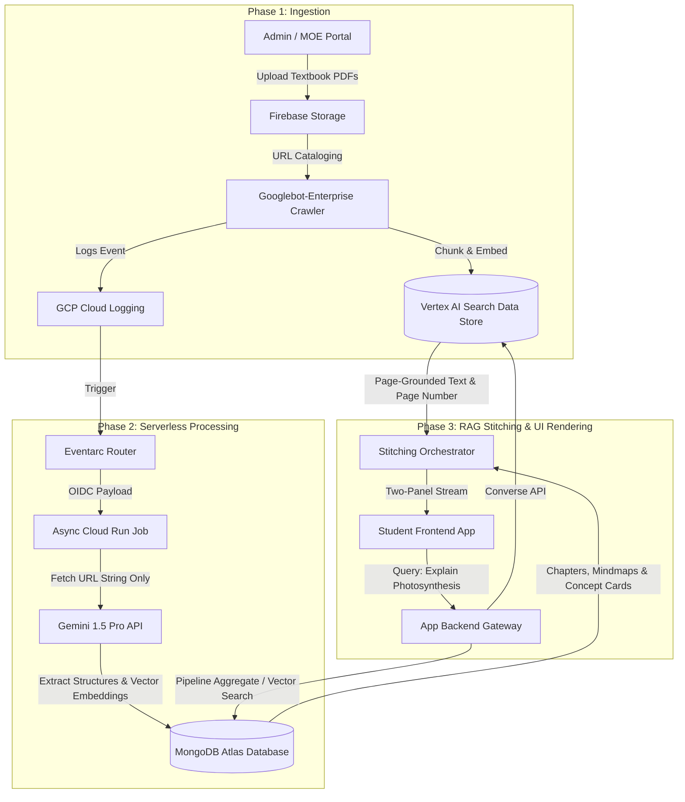
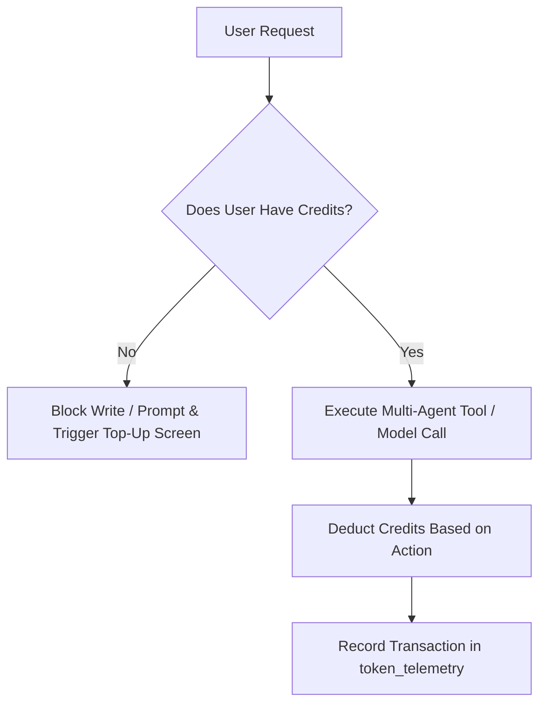
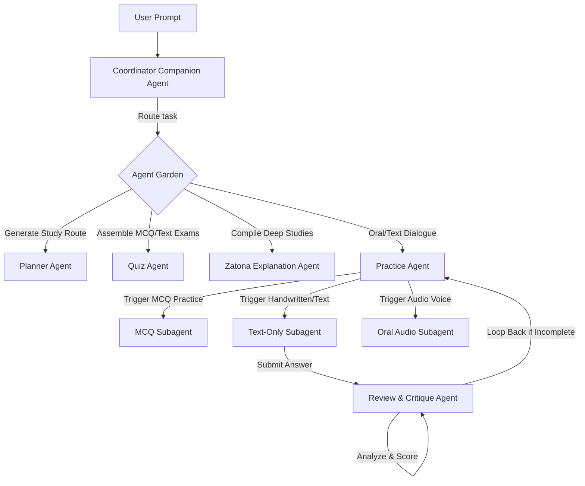

# 🧠 Fahem Multi-Agent Swarm: "AI Tutors in Your Pocket"
## 🗺️ Master Architectural & Engineering Blueprint (v1.0)
**Timestamp**: 2026-05-31T19:47:00+03:00  
**Authors**: Antigravity (AI Architect) & hesham88 (Lead Engineer)  

---

## 🌟 Executive Vision: Fahem Swarm
Fahem is transitioning from a database orchestrator into a complete **personal academic space and educational social network**. The core value proposition is **"A swarm of AI tutors in your pocket."**
Students can:
1. **Explore the Egyptian Ministry of Education (MOE) Textbook Library** directly via semantic page-level groundings.
2. **Plan studies, take adaptive spacing quizzes, practice orally/textually**, and dive into deep explanations (*Zatona*).
3. **Engage in collaborative educational social networks** with real-time updates, groups, activity feeds, parent-child alignments, and privacy shields.

---

## 📑 1. Ingestion, Analysis, & Storage Pipeline (MongoDB & Vertex AI)

We will implement a hybrid, serverless pipeline to handle massive textbook repositories from `https://ellibrary.moe.gov.eg/` without high-memory file download bottlenecks, leveraging **MongoDB Atlas** as our analytical and transactional master core.

### 🔄 The Three-Phase Pipeline Flow



### 🗄️ MongoDB Data Models & Schema Designs

To eliminate mock dataset dependencies, we define strict collection models:

#### A. Collection: `subjects`
```json
{
  "_id": "subject_biology",
  "name": "Biology",
  "icon": "🌱",
  "grade": "Grade 11",
  "language": "ar",
  "createdAt": "2026-05-31T12:00:00Z"
}
```

#### B. Collection: `books`
```json
{
  "_id": "book_moe_bio_g11_t1",
  "subjectId": "subject_biology",
  "title": "General Biology for Grade 11",
  "sourceUrl": "https://ellibrary.moe.gov.eg/books/biology-11.pdf",
  "firebasePath": "gs://fahem-88d40.appspot.com/moe_books/biology-11.pdf",
  "category": "core", 
  "metadata": {
    "grade": "Grade 11",
    "term": "Term 1",
    "year": "2026",
    "language": "ar",
    "bookType": "Student Book"
  },
  "chapters": [
    {
      "chapterNumber": 1,
      "title": "Cell Structure & Energy",
      "pages": [12, 45],
      "mindmap": {
        "root": "Cell Energy",
        "nodes": ["Photosynthesis", "Respiration", "ATP Synthesis"]
      }
    }
  ]
}
```

#### C. Collection: `book_pages` (Vector Embeddings Store)
We will leverage **MongoDB Atlas Vector Search** directly for page-level semantic indexing:
```json
{
  "_id": "page_bio_g11_t1_p12",
  "bookId": "book_moe_bio_g11_t1",
  "pageNumber": 12,
  "chapterNumber": 1,
  "textContent": "Photosynthesis is the process by which light energy is converted into chemical energy...",
  "embedding": [0.0123, -0.0456, 0.9812], 
  "concepts": ["Photosynthesis", "Chloroplast", "Light Reactions"],
  "keywords": ["chlorophyll", "photon", "thylakoid", "glucose"],
  "formulas": ["6CO2 + 6H2O + Light -> C6H12O6 + 6O2"],
  "questions": [
    {
      "questionText": "What are the primary outputs of the light-dependent reactions?",
      "difficulty": "medium",
      "type": "MCQ"
    }
  ]
}
```

---

## 👥 2. Real-Time Social Core & Content Policy Compliance

We will transition the student workspace from a static layout into a dynamic, interactive collaborative hub:

### ⚡ Real-Time Capabilities & Firestore Sync
Instead of manual page refreshes, we will deploy a real-time messaging pipeline:
* **Real-Time Text/Audio Streams**: Uses Firebase Realtime Database or Firestore Snapshot Listeners (`onSnapshot`) to listen directly to chat channels, instantly updating the UI with typing states and messages.
* **Typing Indicator**: Local state triggers a debounced `typing` status write to MongoDB or Firestore, rendering a pulsing `.typing-loader` element in matching group views.
* **Instant Push Notifications**: Deploys FCM (Firebase Cloud Messaging) service workers. Incoming messages or tutor alerts push web-push payloads directly to standard mobile OS notification bars.

### 🛡️ Social Protection, Privacy, & Visibility Controls
* **Parent-Child Association**: Parents can bind to their child's account via a unique registration security key. Once associated, the parent gains read-only access to custom progress telemetry, diagnostic scores, study plans, and daily logs.
* **Friendship & Blocking Engines**:
  * Collection `friendships`: Tracks states (`pending`, `accepted`, `blocked`).
  * If a user blocks another user, standard MongoDB aggregates filter them out of message feeds, group members lists, and active discussion panels automatically.
* **Background Safety compliance sweeps**:
  All content shared in groups or profile walls undergoes an asynchronous safety scanning queue powered by Gemini’s moderation parameters, automatically flagging and hiding offensive text or non-academic image assets.

---

## 🪙 3. Tiered Token Quota & User Profile Engine

To control model costs and separate user classes, we implement credit-based gating:



### 📊 Quota Profile Tiers
We define three core user plans in the `users` collection metadata:

| Profile Tier | Monthly Credit Allowance | Max Upload File Size | Access Level | Action Cost Gating |
| :--- | :--- | :--- | :--- | :--- |
| **Basic (Free)** | 100 Credits | 2 MB (Images/Avatars Only) | Core Subjects, MCQ Practice, Companion | 1 Credit per Chat / MCQ |
| **Premium** | 500 Credits | 20 MB (Academic Hand-written/PDFs) | All Subjects, Text Practice, Planner | 2 Credits/Deep Analysis |
| **Elite** | Unlimited (Fair Use) | 50 MB (Full Notebooks/PDFs) | All Subjects, Oral Practice, Zatona | Automated Resource Gating |

---

## 🗺️ 4. Onboarding Amnesia Loop Fix & Persistent State

To stop onboarding data-loss during page, locale, or language changes:
* **The Onboarding Session Collection (`onboarding_sessions`)**:
  Saves incremental states in MongoDB as the user progresses (`step_phone`, `step_avatar`, `step_school`).
* **Onboarding Logic Rules**:
  1. Once the phone number is verified, the flag `phoneVerified: true` is persisted in their database session. Changing language or navigating to `/` will read the state and resume the onboarding step instead of asking for a new SMS pin.
  2. If the user intentionally clicks "Start Over", we flush the active session cache and re-scaffold a clean onboarding model.
* **RTL Layout Misalignment Fix**:
  The landing page navigation bar header will utilize local CSS variables and strict CSS logical properties (`margin-inline-start`, `flex-direction: row-reverse` based on the locale metadata) to prevent collision with sidebars when Arabic is selected.

---

## 🤖 5. Multi-Agent Swarm System Architecture

We will revamp the floating companion into a central **Coordinator Orchestrator Agent**, routing tasks to domain-specific agent experts:



### 🧠 Strategic Agent Specializations
1. **The Review & Critique Loop Agent**:
   When a student completes a textual answer, this agent analyzes their response against the textbook page grounding. If details are missing, it provides high-quality feedback and prompts the user to type more. **Copy-paste is programmatically blocked on the UI** to stimulate authentic active learning.
2. **The Adaptive Practice Agent**:
   Ensures concept mastery through Spaced Repetition (SRS). Instead of repeating the same questions, it dynamically adapts subsequent questions to explore the same academic concept from alternate angles or different levels of difficulty.
3. **The Zatona deep-explanation Agent**:
   Generates consolidated academic briefs, formulas, and visual mindmaps dynamically based on active textbook pages.
4. **The Planner Agent**:
   Enables creation, editing, status tracking, and automated score-linked progress updates for study calendars.

---

## 🔍 6. Advanced MongoDB-Only Pipelines & Admin Monitoring

Instead of pulling massive datasets into Node/Python memory, all heavy operations will execute directly on the database engine using high-performance queries:

### 📈 Ingestion & Extraction Pipeline (Atlas Search / Native)
* **Metadata & Embedding Insertion**:
  ```python
  # Programmatic bulk write of textbook vectors using PyMongo & MongoDB MCP
  db["book_pages"].insert_many(page_document_payloads)
  ```
* **Textbook Page Semantic Search**:
  Leverages the native `$vectorSearch` pipeline stage to find textbook pages matching a student's prompt:
  ```json
  [
    {
      "$vectorSearch": {
        "index": "vector_index_book_pages",
        "path": "embedding",
        "queryVector": [0.0123, -0.0456, 0.9812],
        "numCandidates": 100,
        "limit": 5
      }
    }
  ]
  ```

### 📊 Reporting & Analytics Pipeline (Aggregations)
We will leverage MongoDB's powerful aggregation framework to generate diagnostic dashboards with zero compute overhead:
* **Admin Dashboard Overview Pipeline**:
  ```python
  # Calculates active registrations, credit usage, and system-wide scores
  db["token_telemetry"].aggregate([
      { "$group": {
          "_id": "$userId",
          "totalCreditsUsed": { "$sum": "$creditsDeducted" },
          "sessionCount": { "$sum": 1 }
      }}
  ])
  ```
* **Adaptive Progress Tracking Pipeline**:
  ```python
  # Generates a student's weak concepts list by aggregating quiz scores
  db["user_activities"].aggregate([
      { "$match": { "userId": "student_123", "category": "quiz" } },
      { "$group": {
          "_id": "$metadata.concept",
          "averageScore": { "$avg": "$metadata.score" }
      }},
      { "$sort": { "averageScore": 1 } } # Weakest concepts first
  ])
  ```

---

## 🧬 7. State-of-the-Art Agent Memory & Evaluation Framework

### 🧠 High-Fidelity Agent Memory Management
To maintain long-term relationships between the student and their swarm of tutors, the agent utilizes a hierarchical, four-layer memory structure:

```
[ User Input ] ──> [ SHORT-TERM MEMORY (Session Context - Buffer) ]
                         │
                         ├─> [ EPISODIC MEMORY (Turn logs, quiz performance) ]
                         │
                         ├─> [ SEMANTIC MEMORY (Grounded textbook facts) ]
                         │
                         └─> [ LONG-TERM MEMORY (Student profile & progress maps) ]
```

1. **Short-Term Memory**: Holds active session conversational histories in MongoDB's `chat_sessions` collections, preventing response-repetition.
2. **Episodic Memory**: Saves sequence-specific events (e.g., student struggled with page 14's formulas in Chemistry on Monday).
3. **Semantic Memory**: Holds general text facts extracted and mapped during Phase 2 textbook ingestion.
4. **Long-Term Memory**: Houses consolidated, structured profiles of user characteristics, goals, plans, and persistent preferences.

### 🧪 Agent Evaluation Framework (`agents-cli eval`)
To ensure high accuracy, clear citations, and safe interactions before launching to the public:
* **Prompt Testing Matrix**:
  We will compile a local evaluation test set (`eval_set.json`) containing typical student queries (e.g. "Explain mitosis in Grade 11 Biology").
* **Automated Quality Checks**:
  Prior to merging code updates or deploying new agent model prompts, we run:
  ```powershell
  google-agents-cli eval run --set eval_set.json
  ```
  This command grades the agent's output against:
  1. **Citation Accuracy**: Verifying page citations refer strictly to the real MOE PDF index.
  2. **Hallucination Rate**: Ensuring the agent is strictly grounded in the ingested MongoDB documents.
  3. **Safety Violations**: Confirming 100% compliance with local Arabic custom filters.

---

> [!NOTE]
> **Implementation Strategy**: We will first establish the core data models and run verification pipelines on small samples of unstructured PDFs to validate parsing accuracy before running the scale crawler.
