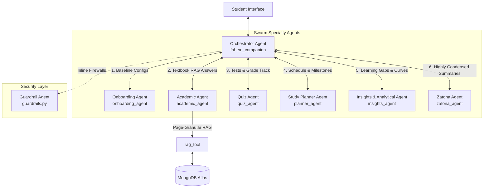
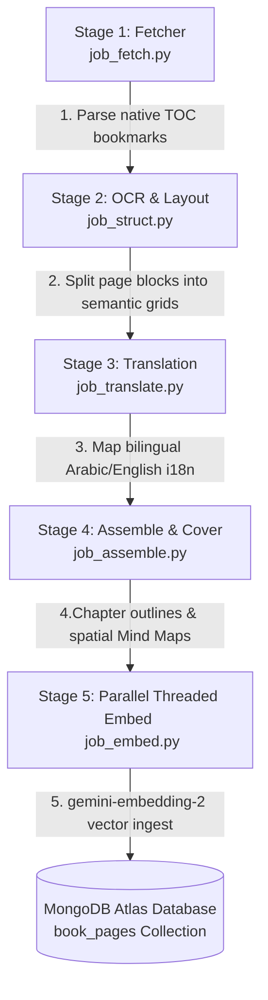

# 🗺️ Fahem AI: Technical Components, Embeddings, and Services

This blueprint documents the multi-agent swarm architecture, sequential vector embedding pipelines, foundational models, API boundaries, and open-source integrations powering **Fahem AI: Localized Curriculum Multi-Agent AI Tutor**.

---

## 🤖 1. The Multi-Agent Swarm

Fahem's multi-agent ecosystem is engineered with isolated, highly specialized agent specialists cooperating through a primary user-facing orchestrator. By avoiding monolithic prompts, each agent maintains a tight context window, keeping reasoning loops deterministic and safe.



### Deep Dive: Individual Agents, Use Cases, and Functions

| Agent Name | Code Identifier | Primary Role & Pedagogical Purpose | Core Use Case | Key Functions |
| :--- | :--- | :--- | :--- | :--- |
| **Orchestrator Agent** | `fahem_companion` | The system's primary state machine, dialog interface, and coordination hub. | Holds student session state, parses intent, and programmatically delegates tasks to specialist subagents. | - Resolves autocomplete macros (`@` for subjects, `#` for books, `/` for command shortcuts).<br>- Translates and mirrors dialogue (English/Arabic).<br>- Intercepts creation intents to build structured `[INTENT: ...]` UI cards. |
| **Onboarding Agent** | `onboarding_agent` | Orchestrates the student's entry point, profile configuration, and OEPA curriculum path. | Welcomes new users, configures their grade/subject focus, and coordinates verification routes. | - Gathers student baseline parameters (grade, learning track, languages).<br>- Bypasses SMS verification steps if database profile returns `phone_verified: true`. |
| **Academic Agent** | `academic_agent` | The core localized educational tutor. | Guides students step-by-step through textbook chapters with specialized pedagogical teaching. | - Queries vector databases using page-granular `rag_tool` context.<br>- Enforces anti-hallucination rules.<br>- Attaches deep-linking citations formatted as `[book_id:pPageNum]` (e.g. `[book_math_12:p42]`). |
| **Quiz Agent** | `quiz_agent` | Manages dynamic learning assessments, parallel practice, and diagnostic testing. | Generates mock exams, parses student answer grids, and computes dynamic grade percentages. | - Adjusts test difficulties and questions dynamically based on student performance.<br>- Generates formatted grading cards. |
| **Study Planner Agent** | `planner_agent` | Coordinates structured educational calendars, milestones, and homework schedules. | Creates custom academic timetables aligned with localized school curricula. | - Calculates estimated reading times per chapter.<br>- Schedules study milestones and alerts.<br>- Generates structured chronological timelines. |
| **Insights & Analytical Agent** | `insights_agent` | The underlying telemetry tracking and cognitive evaluation engine. | Analyzes session durations and score footprints to isolate student performance gaps. | - Processes telemetry documents (`reading_sessions`, `token_telemetry`).<br>- Computes cognitive learning and retention curves.<br>- Recommends targeted study chapters. |
| **Zatona Agent** | `zatona_agent` | Focuses on high-yield Arabic summarizations (Zatona: "the core essence"). | Synthesizes long prose chapters into highly condensed study notes and glossaries. | - Extracts key textbook terms, core definitions, and formulas.<br>- Generates high-yield study flashcards.<br>- Translates concept definitions into dual languages. |
| **Guardrail Agent** | Inline Callback Layer | Active prompt and response firewall. | Filters inputs for prompt injections, limits credit quotas, and masks sensitive system credentials. | - Implements ADK's `before_agent_callback`, `before_model_callback`, etc.<br>- Monkeypatches `MongoClient` to prevent unauthorized database targeting.<br>- Enforces credit constraints & fail-closed error fallbacks. |

---

## 📥 2. Sequential Vector Embedding Ingestion Pipeline

The ingestion pipeline (`ingestion_v2`) parses raw textbooks into high-performance vector indices using **`gemini-embedding-2`** (resolving to exactly **3072 dimensions**). Each ingestion stage enriches content structures before embedding:



### Detailed Embedding Ingestion Mechanics (Stage 5 - `job_embed.py`)

1. **Startup Verification Probe**:
   To prevent catastrophic silent embedding failures, the pipeline initiates an immediate startup probe. It sends a validation string to the **`gemini-embedding-2`** API. If the returned vector length does not match exactly `3072` dimensions, the pipeline halts loudly, logging the error to prevent corruption.
2. **Page Cache Verification**:
   If a page has already been embedded in a previous session, the embedder retrieves the cached vector from local draft storage or MongoDB Atlas, bypassing the API call to save user token credits.
3. **Context-Aware Heading-Path Chunking**:
   Before vectorizing a page's content, the pipeline extracts the headings present in the layout blocks and compiles a hierarchical heading path (e.g. `Chapter 3 › Section 3.2 › Setup › `). This path is prepended to the page text:
   ```python
   heading_path = get_heading_path(blocks)
   final_embedding_text = f"{heading_path}{raw_joined_text}"
   ```
   *Pedagogical Impact*: This context-aware chunking preserves topological coordinates. When a student runs a semantic query, the RAG search matches the exact chapter section where the topic resides, preventing disjointed or out-of-context retrieval.
4. **Resilient API Handling & Fail-Safe SHA256 Fallback**:
   To tolerate network bottlenecks or API quota limitations (HTTP 429), all embedding requests are wrapped in exception handlers. If an API call fails or times out, the system automatically logs the warning and falls back to generating deterministic **SHA256 offline hashing** representations, preventing the background execution pipeline from locking up.
5. **Thread-Safe MongoDB Atlas Syncing**:
    final page documents—complete with the `"embedding": [0.0142, ...]` float array, concepts list, extracted LaTeX formulas, and `i18n` text—are synchronized to the `book_pages` database collection under strict thread locks (`db_write_lock`) via the VPC-secured tunnel.

---

## 🧠 3. Foundational Models

Fahem relies on state-of-the-art Google Gemini models, dynamically choosing model instances based on environments and task complexities:

```
┌────────────────────────────────────────────────────────────────────────┐
│                      Google Gemini Foundational Models                  │
└──────────────┬───────────────────────────────┬─────────────────────────┘
               │                               │
               ▼                               ▼
┌───────────────────────────────┐ ┌───────────────────────────────┐
│       Reasoning & OCR         │ │      Semantic Embedding       │
│      gemini-2.5-flash         │ │     gemini-embedding-2        │
└──────────────┬────────────────┘ └──────────────┬────────────────┘
               │                                 │
               ├─► Layout OCR (Stage 2)          └─► 3072-Dimensional
               ├─► Machine Translation (Stage 3)     Vectorizations 
               ├─► Swarm Agents Context Reasoning    (Stage 5 & RAG)
               └─► Dynamic Quiz Evaluations
```

### Models & Usage Contexts:
1. **`gemini-2.5-flash`** (or **`gemini-3.5-flash`** / **`gemini-3.1-flash-lite`** dynamically resolved):
   - **Context of Usage**: The general workhorse model. Handles multimodal layout OCR extraction (`job_struct.py`) by parsing page PNG rasterizations into structured JSON grids using strict Pydantic schemas. Executes parallel machine translation (`job_translate.py`) of blocks, and powers the active logical reasoning loops of the swarm agents (`fahem_companion`, `academic_agent`, `quiz_agent`, etc.).
2. **`gemini-embedding-2`**:
   - **Context of Usage**: Generates 3072-dimensional vector semantic representations of context-enriched textbook pages. Used both in the ingestion pipeline (`job_embed.py`) to build the RAG search index and in the runtime search tools (`rag_tool`) to vectorize student questions for database matching.

---

## 🔌 4. APIs and External Services

Fahem is a serverless, decoupled microservice architecture anchored to multiple APIs and perimeter secure networks:

* **Google Cloud Run**: Runs the containerized Python ADK backend service (`fahem-agent` in the `us-east4` region) as a private, OIDC-authenticated, stateless microservice.
* **Firebase App Hosting**: Hosts the Next.js TypeScript web application, enabling automatic builds and continuous deployment (CD).
* **Firebase Authentication**: Provides secure, authenticated Google Sign-In workflows for student identities, generating secure JSON Web Tokens (JWT) verified by the backend.
* **Google Cloud Secret Manager**: Secures all production-level credentials, database connection strings (`MONGODB_URI`), and API keys (`GEMINI_API_KEY`, etc.), binding them directly to service containers without plain-text exposure.
* **Google Cloud Armor (WAF)**: Active load-balancer firewall shielding endpoints against DDoS attacks and OWASP threats (SQLi, XSS, RCE, LFI) while enforcing rate limits (100 requests/minute per IP) with temporary 5-minute bans.
* **Google Cloud Model Armor API**: Acts as a pre-flight prompt safety firewall, filtering toxic inputs, preventing jailbreak patterns, and performing Sensitive Data Protection (SDP) text masking.
* **MongoDB Model Context Protocol (MCP) Server**: Provides the Model Context Protocol layer that connects Python ADK agents securely to MongoDB Atlas databases using high-level, parameterized tool representations.
* **Google Custom Search API**: Invoked by the Orchestrator's `search_tool` to perform bounded, grounded open-world web search when queries are prefixed with `[Grounded Web Search Request]`.

---

## 🎨 5. Fonts and Library Integrations

To deliver a premium, visual aesthetic and peer-reviewed educational content, Fahem incorporates Google Fonts and open-source catalogs:

### Curated Typography (Google Fonts):
To avoid boring browser defaults and provide tactile reading comfort, the Next.js frontend integrates premium typography from Google Fonts:
- **Cairo & Tajawal**: Optimized specifically for Arabic text structures. Supports clean rendering, smooth weights, and complete bidirectional layout mirroring when the student switches the interface to RTL mode.
- **Inter, Outfit, & Roboto**: Utilized for clean, modern English layouts, glassmorphic menus, and statistical student insight dashboards.

### OpenStax Open-Source Library:
To supplement localized curricula with high-quality, peer-reviewed textbook materials, the platform incorporates **OpenStax** library catalogs:
- **Wagtail CMS Adapter**: The ingestion crawler features a specialized OpenStax Wagtail API adapter (`/apps/cms/api/v2/pages/?type=books.Book`).
- **Discovery & Harvesting**: Iterates through paginated CMS JSON trees, resolving and mapping direct PDF download URLs (governed by thread-safe concurrent Semaphores).
- **Localized Integration**: Enables the automated ingestion pipeline to fetch, parse, translate, and vectorize authoritative, open-source textbooks on Computer Science, Algebra, Biology, Physics, and Economics, augmenting student curricula safely and legally.
