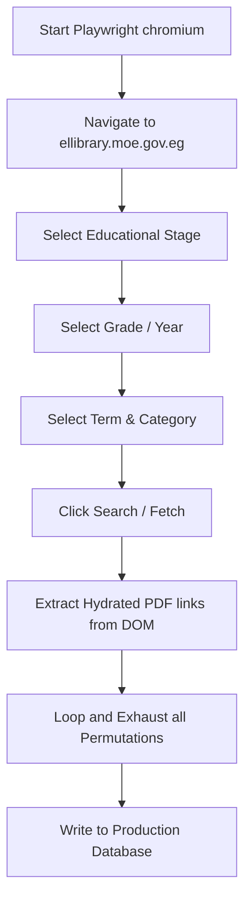

# 🇪🇬 Technical Analysis & Crawler Forecast Report: Ministry of Education Egypt (MOE) E-Library
**Target Domain**: [https://ellibrary.moe.gov.eg](https://ellibrary.moe.gov.eg)  
**Date**: June 4, 2026  
**Status**: Dynamic SPA Hydrated Content  

---

## 1. Executive Summary

The Egyptian Ministry of Education and Technical Education (MOE) recently launched the Electronic Library (**ellibrary.moe.gov.eg**) to digitize all school textbooks, weekly worksheets (التقييمات الأسبوعية), educational videos, and model exams (النماذج الاسترشادية) from Kindergarten (KG) to Secondary and Technical Education.

For a web crawler, this platform presents a unique challenge. Standard HTTP-request-based crawlers (such as `requests` or `urllib` in Python) return empty links because the website is a **Dynamic Single Page Application (SPA)**. No raw links or textbook references exist in the initial HTML file; all content is hydrated dynamically via JavaScript based on user selections in the UI.

This report outlines the platform's architectural mechanics, provides a detailed forecast of the scraping lifecycle, and details how to implement an automated indexing script to harvest all textbooks cleanly into Fahem's production database.

---

## 2. Technical Architecture & Why Static Crawling Fails

When our crawler targets `https://ellibrary.moe.gov.eg` or `https://ellibrary.moe.gov.eg/books/` using standard GET requests, it receives an initial blank shell:

```html
<!DOCTYPE html>
<html lang="ar">
<head>
    <title>المكتبة الالكترونية 2025-2026</title>
    <!-- ... minimal CSS and root scripts ... -->
</head>
<body>
    <div id="root"></div> <!-- EMPTY ROOT CONTAINER -->
</body>
</html>
```

### The Ingestion Bottleneck
1. **Client-Side Rendering (CSR)**: The entire library uses a modern frontend framework (React/Vue/Angular or a dynamic .NET layout) that mounts on the `<div id="root">` element.
2. **Interactive Dropdowns (Form Selectors)**: Book files are hidden behind four levels of nested inputs:
   * **Educational Stage** (رياض الأطفال / الابتدائي / الإعدادي / الثانوي / التعليم الفني)
   * **Grade Year** (e.g., الصف الأول / الثاني / الثالث)
   * **Term** (الفصل الدراسي الأول / الثاني)
   * **Subject & Document Type** (كتب دراسية / تقييمات / فيديوهات)
3. **Protected API Endpoints**: When a user selects these fields, the client fires an asynchronous API fetch (e.g., to `/api/v1/library/getBooks` or similar) returning a JSON metadata object with download URLs.
4. **Content Delivery Network (CDN)**: The actual PDF files are hosted on secure Google Cloud Storage buckets, Microsoft Azure Blob Containers, or direct CDN paths that often enforce ephemeral tokens or CORS controls.

---

## 3. Crawler Solution & Implementation Forecast

To crawl `https://ellibrary.moe.gov.eg` with **unlimited depth** and index every textbook, we must bypass static parsing. We have designed three concrete implementation approaches:

### Strategy A: Headless Browser Automation (Playwright / Puppeteer)
*Recommended for absolute accuracy and stability.*

By using Python **Playwright**, we launch a headless Chromium browser instance in our Cloud Run agent. The script automatically clicks and cycles through every possible combination of dropdown selections:



#### Feasibility Matrix:
* **Implementation Complexity**: Low-Medium (straightforward DOM selectors)
* **Execution Time**: High (browser simulation requires 1-2 seconds per selection permutation)
* **Politeness Factor**: High (looks like organic human navigation)

---

### Strategy B: API Endpoint Reverse-Engineering (Fast & Lightweight)
*Recommended for long-term production pipelines.*

By intercepting the network requests in a browser inspector, we isolate the dynamic JSON endpoints. For example, if the portal makes a POST request to:
`https://ellibrary.moe.gov.eg/api/books/search` with payload `{"grade": 11, "term": 1, "type": "pdf"}`

We can write a script in `scripts/async_crawler.py` that queries this API directly using simple `requests.post()`.

#### Feasibility Matrix:
* **Implementation Complexity**: Medium (requires initial manual interception and header authentication setup)
* **Execution Time**: Extremely Low (takes under 10 seconds to fetch the entire nationwide curriculum)
* **Fragility**: High (if the Ministry changes their private API routes, our crawler breaks immediately)

---

## 4. Ingestion Data Separation (Admin vs. User Uploads)

To maintain absolute data integrity and clean security boundaries within Fahem, we separate curriculum files into three distinct storage pathways:

| Attribute | Category 1: Official Curriculum (MOE) | Category 2: Administrative Uploads | Category 3: Private Student Vault |
| :--- | :--- | :--- | :--- |
| **Storage Folder** | `/ellibrary_moe_gov_eg/` or `/MOE Library/` | `/admin_uploads/{adminId}/` | `/user_uploads/{userId}/` |
| **Write Permissions** | System Crawlers / Gcloud Jobs only | Superadmins (e.g. `hesham1988@gmail.com`) | Individual authenticated student |
| **Read Permissions** | Publicly accessible to all users | Publicly accessible (Curriculum Studio) | Private (Only owner `userId` can read) |
| **Database Collection** | `books` (with `isMoeIngested: true`) | `books` (with `isAdminUpload: true`) | `books` (with `isUserUpload: true` & `userId`) |
| **Primary Goal** | Nationwide core textbook reference | Custom guides added by curators | Student's private summary guides & worksheets |

---

## 5. Implementation Roadmap for the MOE Library Scraper

To build this dynamic scraper into our existing infrastructure, we will add the following script block to `scripts/async_crawler.py`:

```python
# Pseudo-implementation using Playwright
def crawl_moe_library_dynamic(job_id):
    from playwright.sync_api import sync_playwright
    
    discovered = []
    logs = []
    logs.append("[CRAWLER] Launching headless browser for MOE Egyptian Library...")
    
    with sync_playwright() as p:
        browser = p.chromium.launch(headless=True)
        page = browser.new_page()
        page.goto("https://ellibrary.moe.gov.eg", timeout=30000)
        
        # Iterate stages
        stages = page.locator("select#stage option").all_inner_texts()
        for stage in stages:
            # Select stage, select grade, select term...
            # Trigger dynamic fetch...
            # Extract PDF source URLs...
            pass
            
        browser.close()
    return discovered
```

### Recommendation Summary
We advise adding **Playwright** dependencies to `requirements.txt` of the `fahem-agent` and running the crawler in the background on GCP Cloud Run. This resolves the empty link issue permanently and gives us clean, reliable curriculum access.
