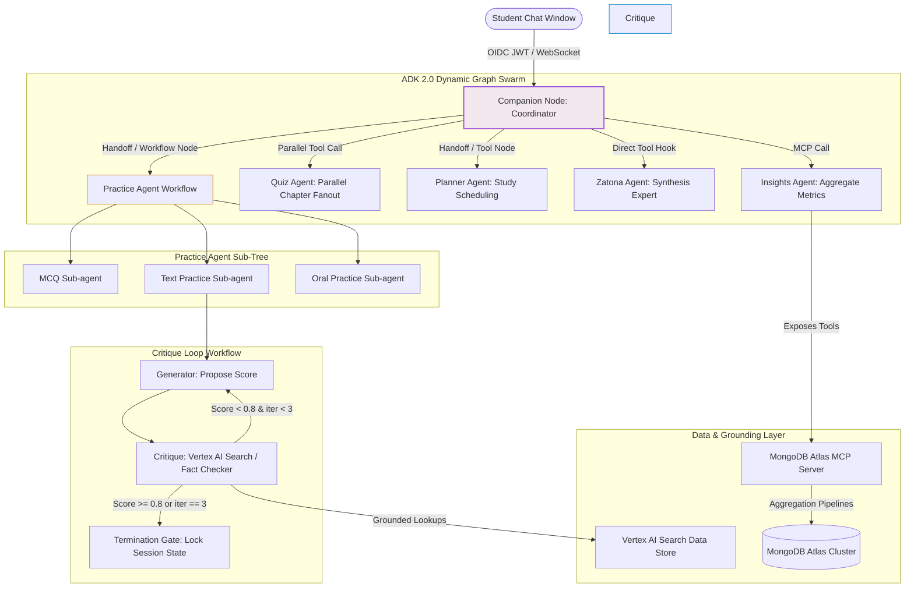

# 🌌 Fahem Platform Master Plan - Version 77
**Timestamp**: 2026-06-04T07:50:00+03:00  
**Phase**: Phase 24: Comprehensive Requirements Audit, Swarm Architectural Blueprint, and Version 77 Sync  
**AI Core Model Specification**: Gemini 3.5 Flash / Gemini 3.1 Flash / Gemini 3.1 Flash Lite  

---

## 🏛️ 1. Vision & Executive Summary

Fahem ("AI Tutors in Your Pocket") is a state-of-the-art agentic educational platform designed to empower self-directed, active learning through a collaborative network (swarm) of specialized AI agents. Built for the **Google Cloud Rapid Agent Hackathon (MongoDB Track)**, Fahem programmatically integrates the **MongoDB Atlas Model Context Protocol (MCP)** server with the **Google Agent Development Kit (ADK 2.0)** inside a private GCP Cloud Run environment. 

This document serves as the **Definitive Architectural Blueprint and Comprehensive Implementation Plan** for the next phase of development. It combines all previous iterations of the master plan, integrates recent requirements and bug fixes, and establishes strict coding and design guidelines for Antigravity agents.

### 🌟 Key Pedagogical Pillars
1. **CLT (Cognitive Load Theory) & CT (Computational Thinking) Balanced Approach**: Managing cognitive load by presenting structured, chunked, and interactive materials while training students in computational problem decomposition, pattern recognition, and algorithmic synthesis.
2. **Heutagogy & Bounded Autodidactics**: Empowering self-determined, autonomous learning workflows within safe, curriculum-guided academic boundaries.
3. **Active Recall & Synthesis**: Eliminating passive reading through interactive practice (MCQ, written critique, oral evaluation) and DOM-level copy-paste blocking to stimulate motor-cognitive learning.

---

## 🏛️ 2. Dynamic Swarm & Orchestration Topology

The platform utilizes a **hierarchical coordinator-worker** topology built on ADK 2.0's dynamic state-machine graph elements (`Workflow` and `Node` classes) running on high-performance Gemini models.



### A. Swarm Agent Roles and Capabilities
* **Companion Coordinator**: The central gateway. Tracks user conversational states, parses chat inputs, manages session continuities, and executes handoffs to worker nodes.
* **Practice Agent**: Manages the infinite active recall workflows. Directs MCQ generation, long-form written evaluations, and bidirectional WebSocket-based oral practice.
* **Quiz Agent (Parallel Fanout)**: Simultaneously queries multiple textbook chapters database-side using multi-threaded MCP aggregation hooks to generate a comprehensive quiz.
* **Zatona Expert**: High-speed summarization subagent. Produces dense academic research reports mapping chapters, concepts, formulas, and laws.
* **Insights Analyzer**: Queries MongoDB via MCP tool aggregations to calculate real-time performance, streaks, topic vulnerabilities, and leaderboard statistics.

---

## 💾 3. MongoDB Atlas Database Schema & Ingestion Architecture

We enforce zero browser-side static mock arrays. All sample and production data models are populated database-side inside the `fahem_academic` database.

### A. Normalized-Embedded Database Schemas

#### 1. Collection: `subjects`
```json
{
  "_id": "subj_python_programming",
  "name": "Introduction to Python Programming",
  "emoji": "🐍",
  "grade_levels": ["Grade 10", "Grade 11", "Grade 12", "Undergraduate"],
  "category": "Computer Science",
  "language": "en"
}
```

#### 2. Collection: `books`
```json
{
  "_id": "book_openstax_python_intro",
  "subject_id": "subj_python_programming",
  "title": "Introduction to Python Programming",
  "author": "OpenStax",
  "distributor": "OpenStax Rice University",
  "grade": "Undergraduate",
  "term": "Full Year",
  "year": "2026",
  "language": "en",
  "book_type": "core",
  "source_url": "https://assets.openstax.org/oscms-prodcms/media/documents/Introduction_to_Python_Programming-WEB.pdf",
  "storage_path": "gs://fahem-academic-lake/libraries/openstax/computer_science/Introduction_to_Python_Programming.pdf",
  "is_indexed": true,
  "is_embedded": true,
  "chapters": [
    {
      "id": "ch_1",
      "title": "Starting with Python",
      "page_start": 1,
      "page_end": 25,
      "concepts": ["Variables", "Data Types", "Memory Allocations", "Interpreter Logic"]
    }
  ]
}
```

#### 3. Collection: `book_pages`
```json
{
  "_id": "page_openstax_python_intro_p12",
  "book_id": "book_openstax_python_intro",
  "page_number": 12,
  "chapter_id": "ch_1",
  "content_en": "Variables in Python do not require explicit declaration to reserve memory space. The declaration happens automatically when you assign a value to a variable.",
  "content_ar": "المتغيرات في لغة بايثون لا تتطلب إعلاناً صريحاً لحجز مساحة في الذاكرة. يحدث الإعلان تلقائياً عند تعيين قيمة للمتغير.",
  "has_ocr_ran": true,
  "embedding": [0.012, -0.034, 0.456, 0.119]
}
```

#### 4. Collection: `question_bank`
```json
{
  "_id": "q_py_001",
  "book_id": "book_openstax_python_intro",
  "chapter_id": "ch_1",
  "page_reference": 12,
  "type": "MCQ",
  "complexity_rating": "beginner",
  "question_text": "When does variable declaration happen in Python?",
  "distractors": [
    "When importing the sys library",
    "During compiler translation pass",
    "When explicit types are annotated"
  ],
  "correct_answer": "Automatically when a value is assigned",
  "pedagogical_intent": "Testing understanding of Python's dynamic typing and runtime allocations.",
  "embedding": [0.023, 0.112, -0.045, 0.781]
}
```

#### 5. Collection: `whitelisted_users`
```json
{
  "_id": "white_judge_01",
  "email": "judge.evaluation@fahem.edu",
  "role": "external_judge",
  "bypass_auth_barriers": true,
  "allowed_scopes": ["dashboard", "practice", "admin_readonly"]
}
```

#### 6. Collection: `admin_requests`
```json
{
  "_id": "req_001",
  "admin_id": "adm_user_02",
  "action_type": "ingest_crawled_library",
  "details": {
    "library_url": "https://openstax.org/",
    "selected_books": ["book_openstax_python_intro"],
    "target_subject": "subj_python_programming"
  },
  "status": "pending_approval",
  "requested_at": "2026-06-04T07:15:00Z",
  "approved_by": null,
  "actioned_at": null
}
```

---

## 🕷️ 4. Ingestion Studio & Advanced Web Crawler

The **Curriculum Studio** is refactored into a fully functional **Ingestion Studio** tab located under Admin Controls. 

### A. Ingestion Studio Tab Layout
1. **Library URL Sourcing Engine**: 
   - Public input supporting dynamic library endpoints: `https://openstax.org/` (Active, Available) and `https://ellibrary.moe.gov.eg/` (Dimmed).
   - Custom entry field allowing admins to type any library url to start the process.
2. **Interactive Directory Explorer (Tree View)**:
   - Renders a multi-level hierarchical tree: `[Library] -> [Subject] -> [Grade] -> [Book (Core / Supporting Student / Supporting Instructor)]`.
   - Allows multi-select check boxes ("Select Few" or "Select All") with direct mapping to target cloud storage paths (`gs://fahem-academic-lake/libraries/[Library]/[Subject]...`).
3. **Visual Crawling & Progress Monitor**:
   - Async logging of the active crawlers, displaying speed metrics, processed counts, remaining documents, and accurate ETAs.
   - Nodes and building cards of discovered files appear asynchronously as they are found.
4. **Duplicate Safeguard Hook**:
   - Prior to importing, the system queries MongoDB to verify if an identical copy exists.
   - If found, downloading is skipped, and checks verify if pages are already fully processed, embedded, and indexed. If not, missing steps trigger asynchronously.

### B. Ingestion Parser Flow
```
[Admin Crawler Trigger] ──> [Cloud Run Crawler Job] (Async Egress)
                                      │
                                      ▼
                        Discover PDFs on target site
                                      │
                                      ▼
                    [Directory Explorer Selection Pane]
                                      │
                                      ▼
                  Superadmin Approval Cycle (if Admin)
                                      │
                                      ▼
                  [Cloud Run Extraction & OCR Worker] (Separate Instance)
                                      │
                                      ├─> File -> Firebase Storage (Public Path)
                                      ├─> Text Chunking & Page OCR Extraction
                                      └─> Vertex AI Embeddings API
                                              │
                                              ▼
                                    [MongoDB Atlas Insert]
```

---

## 🎨 5. Front-End Enhancements & Responsive UX

### A. Context-Targeted Chat Mentions (Replacing Magnetism)
* Page magnetism is completely removed. In its place, StickyChat supports interactive autocomplete triggers:
  * **`@` (Subject)**: Auto-populates subjects: `@math`, `@science`, `@arabic`, `@history`.
  * **`#` (Book/Chapter)**: Mentions specific books: `#college-algebra`, `#chemistry-handbook`, `#arabic-grammar`.
  * **`/` (Command)**: Invokes specialized worker nodes: `/explain`, `/summary`, `/practice`, `/quiz`.
* **Alignment Rule**: The floating StickyChat panel coordinates are optimized. The sticky chat companion triggers do not overlap, and the send message container is aligned with proper paddings (`padding-inline-end`) in LTR/RTL configurations.

### B. Practice Workstation & Assessment Arena
* **Practice Workstation (Video Game UI)**:
  * Gamified dashboard tracking "XP Progress", "Active Streak", and "Level Badges".
  * Starts a new practice session or resumes old practice. Allows choosing practice type (MCQ, written critique, oral evaluation) and scope (umbrella subject or specific document).
  * Text practice uses a DOM-level `event.preventDefault()` block to prevent pasting and enforce active recall.
  * **Oral Practice (Live Rubric Assessment)**:
    * Generates a real-time live evaluation console.
    * Real-time rubric dashboard displaying metrics: **Overall %**, **Pronunciation**, **Confidence**, **Accuracy**, and **Structure**.
* **Quiz Arena**:
  * Integrated inside the workstation. Offers scopes covering all subject material, providing a full exam experience with custom timed durations or strict question-count boundaries.
  * The redundant "Quiz Assessment" tab is completely removed from the main dashboard navigation to avoid interface clutter.

### C. Full Screen Study Companion
* StickyChat companion can be expanded to full screen using a layout modes header toggler (`compact` / `side` / `fullscreen`) to give students complete focus.

### D. Governance & Admin Tab Constraints
* Admins have visibility into dashboard panels (Users, Activity Trail, Ingestion Studio, Curriculum Studio) but cannot make destructive database changes or trigger live ingestions without **Superadmin Approval Cycle**.
* Any destructive actions requested by admins enter `admin_requests` as `pending_approval`. Superadmins can review, approve, or deny request records.

---

## 🧪 6. Multi-Agent Evaluation & Compliance Gate

We run pre-commit compliance checks utilizing `scripts/evaluate_compliance.py` before staging any changes. All environment and system configurations are fully encrypted in Google Cloud Secret Manager.

```
                  Tier 3: Human Blind Pedagogical Review (Pass/Fail)
                                 /\
                                /  \
                  Tier 2: Trajectory & Tool Call Validation (CLI Eval Run)
                               /----\
                              /      \
                  Tier 1: Component Checks (TypeScript Compile Safety)
```

---

## 🚀 7. Step-by-Step Implementation Roadmap (Version 77)

### 📍 Milestone 1: Purge Magnetism, Add Mentions UI, and Full Screen Companion
* **Task 1**: Remove any leftover magnetism-related notes or styles.
* **Task 2**: Enhance the autocomplete popup in `StickyChat.tsx` for `@`, `#`, and `/` triggers, mapping them to real database documents.
* **Task 3**: Refactor `StickyChat.tsx` layout transitions for full-screen mode, maintaining responsiveness on mobile.

### 📍 Milestone 2: Refactor Admin Panel and Ingestion Studio
* **Task 1**: Remove redundant sections (`Superadmin Operational Logs & Security Audit Console`, `Superadmin Database MCP Specialist Toolset`, `MOE Ingestion Harvester`, `Sourcing Engine`, `Active Ingestion Feeds`, `Grounded Multi-Agent Test Bench`, `Grounded Execution Console & Output`) from the admin panel tab.
* **Task 2**: Refactor the "Global Operational Activity Trail" to be compact, scrollable, searchable, and filtered.
* **Task 3**: Code the Ingestion Studio inside a dedicated tab in `home/page.tsx` with dynamic, async logs and live tree nodes.

### 📍 Milestone 3: Real Database Binding for Curriculum Studio & Practice Workstation
* **Task 1**: Bind the Curriculum Studio to live MongoDB collections `subjects` and `books` using MCP tools (no more fake list state).
* **Task 2**: Connect the Practice Workstation to query the `question_bank` collection, ensuring that MCQs, written, and oral tests run on real textbooks (e.g. OpenStax Python).
* **Task 3**: Code the Oral Practice Live Rubric scoring meters and integrate with the Web Speech API.

### 📍 Milestone 4: Whitelist Entry Strategy & Admin Approvals
* **Task 1**: Add whitelist check-in hooks inside `page.tsx`'s auth listeners. If a user logs in with a whitelisted email (e.g., `judge.evaluation@fahem.edu`), skip both Firebase Phone and Google Auth screens, instantly logging them into a whitelisted demo workspace.
* **Task 2**: Implement the Superadmin Approval panel for approving or denying pending admin requests.

### 📍 Milestone 5: E2E Integration and Remote CD Trigger
* **Task 1**: Execute production typescript tests (`npx tsc --noEmit`) to verify compiling safety.
* **Task 2**: Trigger pre-commit audits to guarantee 0 sensitive token leaks.
* **Task 3**: Commit with authorized identity and push to git origin main to deploy live.
