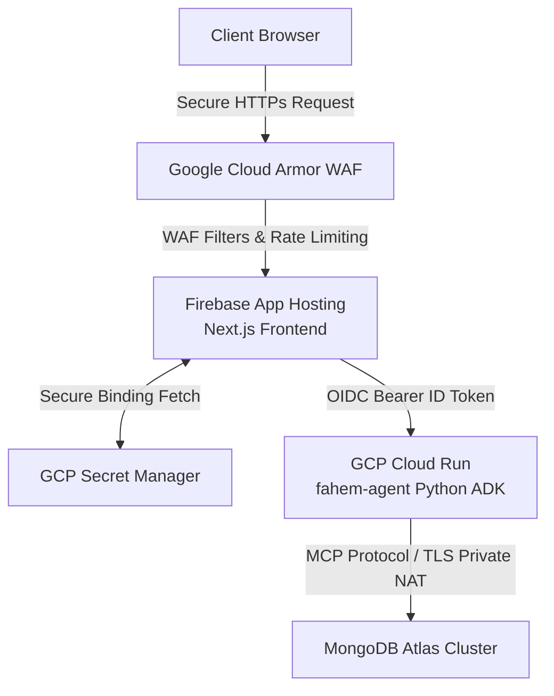

# 🛡️ Fahem Project Review & Protocols Audit

**Project Name**: Fahem (فاهِم - Arabic for "Comprehending")  
**Workspace**: `fahem`  
**Latest Revision**: Plan v72.0  
**Timestamp**: 2026-05-31T14:02:00+03:00  

---

## 🌟 1. Project Explanation & Architecture

**Fahem** is an enterprise-grade, secure, multi-agent AI database orchestrator developed for the **Google Cloud Rapid Agent Hackathon (MongoDB Track)**. It is designed to provide safe, natural-language interfaces over complex MongoDB Atlas databases, collections, and multi-stage aggregation pipelines. 

To bridge serverless web clients and highly sensitive database operations, the project adopts a state-of-the-art **zero-trust, decoupled topology**:



### Key Technical Pillars:
1. **The Web Frontend (`web/`)**:
   - Built on **Next.js App Router (TypeScript)** and hosted on **Firebase App Hosting** for seamless GitHub-triggered Continuous Deployment (CD).
   - Styled using pure **Vanilla CSS** featuring a sleek, responsive **Cream Paper Theme** with glassmorphic elements and GPU-accelerated interactive canvas background spheres.
   - Fully localized in **7 languages** (Arabic, English, French, German, Spanish, Italian, and Chinese) with complete **Bidirectional layout mirroring** (LTR/RTL) adjusting menus, lists, icons, and typing flows dynamically.
   - Features **Firebase Authentication** supporting Google sign-in and a robust, multilingual 2-stage SMS **Phone Authentication** flow.
   - Secure serverless Next.js API routes validate permissions, interact with MongoDB metadata directly using high-performance Native Driver logic, and securely proxy real-time streaming agent outputs.

2. **The Multi-Agent Backend (`agents/`)**:
   - Built with the programmatic **Google Agent Development Kit (ADK) in Python** and containerized (`Dockerfile`).
   - Deployed on **Google Cloud Run** (`fahem-agent` in region `us-east4`) under strict isolation settings (`--no-allow-unauthenticated`), requiring secure OpenID Connect (OIDC) Bearer Tokens for service-to-service communication.
   - Enforces a programmatic **MongoDB Model Context Protocol (MCP) server** structure to wrap complex collection analysis, aggregation, and query tasks securely.

---

## 🏗️ 2. Core Project Protocols

Fahem implements specialized execution protocols to enforce cognitive continuity, responsive aesthetics, and absolute codebase security:

### A. Multi-Task Focus & Structured Collaboration Protocol
To prevent context drift and safeguard development tracks during long context compaction loops:
1. **The Multi-Task Processing Queue**:
   - **Intercept & Register**: New user requests or feature pivots are registered as pending in the `Pending Task Queue`.
   - **Atomic Execution**: The current thread of execution (edits, compilation, static test checks, compliance sweeps, and pushes) is never disrupted or abandoned mid-work.
   - **Queue Transition**: Only transitions to next tasks upon 100% build verification of current milestones.
   - **State Synchronization**: Re-reads prior workspace configurations, memory logs, and active session statuses upon task transition.
2. **Mandatory Reporting Protocol (The Collaboration Standard)**:
   At the end of *every single turn*, the agent must output a structured three-tier status block:
   - **I. SUMMARY**: Concise, high-level business rationale and turn accomplishments.
   - **II. DETAILED REPORT**: Database operations, code changes, pipeline/compilation times, and compliance status.
   - **III. QUICK SHORT RECAP**: Dense status tracking lists (✅ Finished, ⏳ Active, 📋 Pending Queue, 🚀 Next Milestone).

### B. Responsive Mobile-Friendly UI Protocol (`responsive_mobile_friendly_UI`)
- **Desktop-First Component Degradation**: Layout containers flex-wrap and sidebar layouts dissolve into contents (`display: contents`) on screen widths `< 900px`, shifting to space-saving horizontal bars or collapsible drawers.
- **Collapsible Hamburger Drawer Navigation**: Refactors layouts to support a slide-out navigation panel with rotating exit buttons and custom `.sidebar-backdrop` glass-blur sheets.
- **Fluid Grid Wrapping**: Preset queries, metrics, and cards stack into standard `1fr` grids with compact gap padding on screens `< 600px`.
- **Auto-Scrolling Data Tables**: All markdown tables returned by database models leverage nested `overflow-x: auto` containers to prevent horizontal overflows.
- **Concentric Ambient Loaders**: Shared concentric glowing loader spinners, pulsing CPU SVG logos, and background ambient spheres scale dynamically.

---

## 🛡️ 3. Mandatory Security Guardrails

Due to the sensitivity of direct database interactions, Fahem enforces a zero-trust, multi-tiered security model:

1. **GCP Model Armor pre-flight filter**: Standard pre-filter protecting the system from prompt injection attacks and masking sensitive data using Google Cloud Sensitive Data Protection (SDP).
2. **Identity-Gated Writes**: Rejects database mutations (`insert`, `update`, `delete`, `drop`) for unauthenticated users, raising explicit `PermissionError`s. In concurrent Cloud Run settings, it extracts validated tenant credentials dynamically from arguments or nested document properties.
3. **Credit-Based Quotas**: Rejects write operations once a user's active session credit balance is exhausted.
4. **No Direct PyMongo Mutations**: To prevent unauthorized mutations, all database writes are programmatically delegated through high-level parameterized MCP tools (such as `insert_user_report`) rather than direct client-side raw queries.
5. **Zero Plaintext Secret Exposures**: All credentials and API keys reside securely in **Google Cloud Secret Manager**. Modified files are scanned before Git commit to prevent leaks.
6. **reCAPTCHA Enterprise Integration**: Leverages front-end Recaptcha execution (`grecaptcha.enterprise.execute` with site key `6LfT9wQtAAAAAFElDHZ9ddSZHbKzMZx2-IO7PLKV`) and backend validation using Google's SDK, masking badge overlaps smoothly via custom CSS.

---

## 🚀 4. The Development & Deployment Lifecycle

To maintain high development quality and secure builds, developers must strictly adhere to the following lifecycle protocols:

### A. The Developer Process (Step-by-Step)
1. **Branch Checkout & Local Setup**: Spin up the local environment and auto-compile dependencies securely:
   ```powershell
   .\scripts\deploy\deploy_local.ps1
   ```
2. **Safe Coding Rules**:
   - **No Plaintext Secrets**: Write credentials exclusively in `web/.env.local` or `ignore/storage_secrets.json`. Never hardcode keys.
   - **No Direct PyMongo Writing**: Custom database mutations must be encapsulated as safe, high-level ADK tools.
3. **Turn Logging**: Log every user interaction and strategic turn in the append-only log: `log/turn_log.md`.
4. **State Revision Tracking**: Version plans, walkthroughs, and task boards under `memory/` using the file format `plan_vXX.md`, `tasks_vXX.md`, `walkthrough_vXX.md` with explicit date-time ISO-8601 timestamps.

### B. Pre-Deployment checks (The Pre-Flight Gate)
Before any code is committed, staged, or pushed to production:
1. **Run the Automated Compliance Auditor**:
   ```powershell
   python scripts/evaluate_compliance.py
   ```
   *Checks: Git author configuration matching, plaintext secret leak scan, unapproved competitor AI references (such as OpenAI/Claude).*
2. **Execute i18n Synchronization & Validation**:
   ```powershell
   python scripts/sync_dictionaries.py
   python scripts/validate_i18n.py
   ```
   *Checks: Compares translation keys against English. Fails compilation if any language dictionary (ar, en, es, fr, de, it, zh) is missing labels.*
3. **Tune Database Indexes**:
   ```powershell
   python scripts/build_mongodb_indexes.py
   ```
   *Checks: Establishes unique constraints and compound indexes on Atlas collections.*
4. **Run Production Builds**: Ensure Next.js static asset bundling completes with zero errors (`npm run build`).

### C. During Deployment
1. **Configure Git Identity**: Enforce authorized Git credentials locally to pass security triggers:
   ```bash
   git config user.name "hesham88"
   git config user.email "hesham1988@gmail.com"
   ```
2. **Execute the Deployment Trigger**:
   - To build and push the backend agent service to GCP Cloud Run:
     ```powershell
     .\scripts\deploy\deploy_agent.ps1
     ```
   - To commit and push the web application code to trigger Firebase App Hosting continuous deployment:
     ```powershell
     .\scripts\deploy\deploy_web.ps1 -CommitMessage "feat: integrated phone sms login validation"
     ```
   - Master Deployment: Deploys agent and triggers web frontend builds sequentially:
     ```powershell
     .\scripts\deploy\deploy_all.ps1 -CommitMessage "chore: production build release"
     ```

### D. Post-Deployment Verification (Smoke Tests)
1. **Cache Control Amnesia Checks**: Test sequential conversational queries to verify `/api/agent` GET routes do not cache session outputs (verifying `cache: "no-store"` status).
2. **Perimeter Verification (WAF & DDoS)**: Ensure Google Cloud Armor rate limiters are active (restricting client requests to **100/minute** with a **5-minute timeout ban**).
3. **SMS Phone Auth Validation**: Verify that the visible reCAPTCHA visual verifier displays and executes MFA code transactions cleanly.
4. **RTL/LTR Visual Verification**: Confirm that selecting Arabic layout swaps the interface flow completely without overlapping the floating chat companion bubble.

---

## ⚙️ 5. Automated Jobs & Reconciliation Engines

Fahem implements high-reliability, automated reconciliation and alignment jobs:

| Script File Path | Job Name | Purpose & Reconciliation Mechanics |
| :--- | :--- | :--- |
| **[`scripts/evaluate_compliance.py`](file:///C:/Users/hesh1/Desktop/fahem/scripts/evaluate_compliance.py)** | **Compliance Auditor** | Crawls the codebase to identify local path leaks, plaintext API keys, mismatched Git commit identities, or unapproved competitor libraries. Generates versioned Markdown reports in the `doc/` folder. |
| **[`scripts/build_mongodb_indexes.py`](file:///C:/Users/hesh1/Desktop/fahem/scripts/build_mongodb_indexes.py)** | **Database Schema & Index Tuner** | Reconciles the database model indexes on MongoDB Atlas. Builds unique indexes for user ids, sparse unique emails/usernames, and critical compound indexes (`senderId` + `recipientId` + `timestamp`) for lightning-fast real-time bidirectional chat queries. |
| **[`scripts/sync_dictionaries.py`](file:///C:/Users/hesh1/Desktop/fahem/scripts/sync_dictionaries.py)** | **Translation Key Synchronizer** | Resolves translation disparities. It crawls `en.json` keys, identifies missing labels in other dictionary files (`ar`, `de`, `es`, `fr`, `it`, `zh`), and auto-injects missing translations, maintaining perfect alphabetical sorting order. |
| **[`scripts/validate_i18n.py`](file:///C:/Users/hesh1/Desktop/fahem/scripts/validate_i18n.py)** | **Internationalization Validator** | Scans translation dictionary files to ensure 100% key parity across all 7 language locales. If keys are missing, the job fails with an exit code 1 to abort pre-deployment pipelines. |
| **[`scripts/deploy/configure_cloud_armor.ps1`](file:///C:/Users/hesh1/Desktop/fahem/scripts/deploy/configure_cloud_armor.ps1)** | **Perimeter Security Engine** | Configures external HTTP load-balancer security policies, binds serverless NEGs, and registers preconfigured OWASP WAF rules (SQLi, XSS, RCE, LFI) along with client rate limiters. |

---

> [!TIP]
> **Best Practice Compliance Reminder**: Always execute `evaluate_compliance.py` and `validate_i18n.py` locally before requesting pull-request staging to prevent automated build-breaking on the remote repositories.
