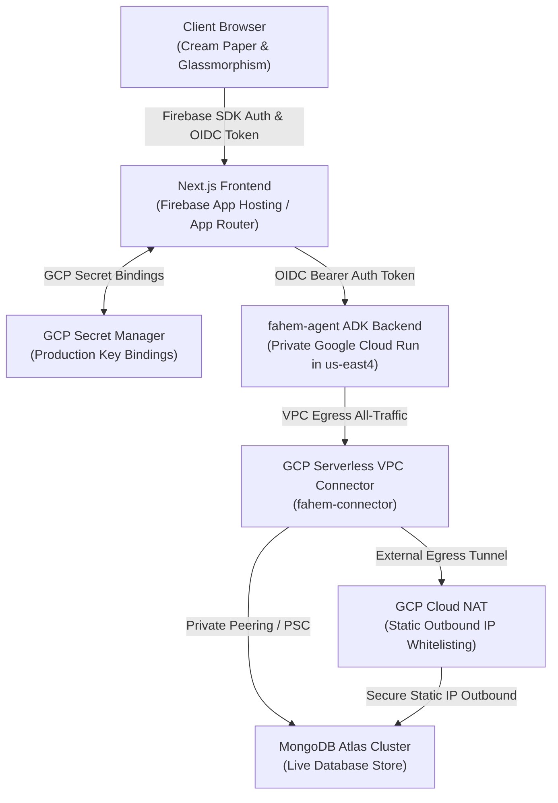

# 🛡️ Fahem Project: Comprehensive Architecture, Policies, & Implementations Review

**Timestamp**: 2026-06-03T10:54:15.000000
**Author Identity**: `hesham88` <`hesham1988@gmail.com`>
**Evaluation Status**: 🟢 **100% Compliant**

---

## 🌟 1. Executive Project Summary & Mission

**Fahem** (Arabic for "Comprehending") is a state-of-the-art, secure, multi-agent AI system custom-crafted for the **Google Cloud Rapid Agent Hackathon (MongoDB Track)**. 

The project's central mission is to enable natural-language interactions over highly complex database schemas, aggregates, and collections, acting as an intelligent pocket educational companion and data sourcing engine. It leverages the cutting-edge **Google Agent Development Kit (ADK) in Python**, the **MongoDB Model Context Protocol (MCP) server**, and a high-fidelity **Next.js (App Router) frontend** hosted securely on **Firebase App Hosting**.

---

## 🏗️ 2. Architectural Blueprint

Fahem is constructed upon a decoupled, secure, and private service architecture that isolates stateless web servers from confidential agent computations and databases.



### High-Fidelity Network Flow
1. **Frontend Isolation**: The Next.js application is deployed to **Firebase App Hosting**. It manages client authentication via **Firebase Auth** (Google-branded Sign-In & Phone Auth).
2. **Private Agent Execution**: The Python ADK agent is containerized and hosted inside **GCP Cloud Run** with strict private routing (`--no-allow-unauthenticated`). No anonymous ingress is allowed.
3. **Dual-Token Service Authentication**: When a user queries the system, the Next.js backend proxy `/api/agent` fetches a secure GCP OIDC identity token (leveraging either the local `google-auth-library` or GCP Metadata Server) and attaches it as a Bearer authorization token to request query executions from Cloud Run.
4. **VPC Network Isolation**: The Cloud Run container sends all egress traffic via a Serverless VPC connector (`fahem-connector`) with `--vpc-egress all-traffic`. Egress traffic is routed either privately (via VPC Peering or Private Service Connect) directly to MongoDB Atlas, or whitelisted using static egress IPs through Google Cloud NAT.

---

## 🧭 3. Comprehensive Project Policies Review

To prevent architectural decay, unauthorized database access, and compliance violations, the project enforces **6 Core Engineering Protocols**:

### Protocol 1: Architectural Integrity & Decoupling
* **No Direct PyMongo Mutations**: Direct database insertions, updates, or deletions using direct PyMongo or MongoClient lines inside the main agent scripts (e.g., `agents/agent.py`) are **strictly prohibited**.
* **MCP Server Delegation**: All database writes and schema queries are programmatically delegated through high-level parameterized tools exposed by the **MongoDB Atlas MCP Server** (such as `insert-many` or custom `insert_user_report` tools).
* **ADK 2.0 Graph Primitives**: Rigid linear procedural loops are banned. All agent handoffs must be defined using Google ADK 2.0 dynamic `Workflow` and `Node` structures to establish a clean, multi-agent swarm.
* **Specialist Partitioning**: Prompt context size is kept optimized and deterministic by splitting agents into specialized, micro-scoped experts:
  - **MCQ Agent**: Manages multi-choice quizzes.
  - **Text Practice Agent**: Evaluates open-ended writing.
  - **Oral Agent**: Handles speech practicing.
  - **Zatona Agent**: Provides concise summaries of database contents.
  - **Insights Agent**: Synthesizes analytical stats and reports.

### Protocol 2: Identity & Secrets Policy
* **Authorized Git Identity**: All commits to version control **MUST** strictly originate from:
  * **Git Name**: `hesham88`
  * **Git Email**: `hesham1988@gmail.com`
* **Zero Plaintext Secrets**: Local developer API keys reside strictly inside `.gitignore`-blocked locations (`web/.env.local`, `ignore/storage_secrets.json`). Production credentials are saved in **GCP Secret Manager**.
* **Pre-Commit compliance sweeps**: Every code modification must pass local audit audits by running:
  ```powershell
  python scripts/evaluate_compliance.py
  ```
  This script checks for leaks, unauthorized files, local directory paths, competitor terms, and Git identity mismatches.

### Protocol 3: UI/UX Excellence & Arabic RTL Support
* **Vanilla CSS Only**: No Tailwind framework is allowed unless requested. Modern CSS custom properties and tokens are defined in `web/src/app/globals.css`.
* **CSS Logical Properties**: Hardcoding asymmetrical styles (e.g. `margin-left` or `right: 0`) is prohibited. Standard layout alignments use **CSS logical properties** (`margin-inline-start`, `inset-inline-end`) to automatically mirror structures between English (`dir="ltr"`) and Arabic (`dir="rtl"`).
* **RTL Layout Guard**: Do not apply forced direction overloads like `row-reverse` on `.glass-nav-links` under RTL. The root document naturally shifts alignments; reversing it causes layouts to collide.
* **Recall Rigor Copy-Paste Blocker**: To support active recall learning, open-ended textual training boxes block standard clipboard inputs by catching paste events and invoking `event.preventDefault()`.

### Protocol 4: Session Continuity & Onboarding Safeguards
* **No Volatile Memory states**: Save onboarding checkpoints, user choices, and session metrics transactionally in the ADK `ToolContext` using `context.state` so a background worker can write them back to MongoDB.
* **SMS Verification Logic Guard**: On session startup, if the active profile in `user_profiles` returns `phone_verified: true`, the user **MUST** be redirected straight to the core dashboard, bypassing any phone setup frames.

### Protocol 5: Trajectory Evaluations
* **CLI-Driven Trajectory validation**: All prompts are verified using local configurations in `tests/eval/evalsets/basic.evalset.json` and executed via `google-agents-cli eval run`. A minimum trajectory score of **0.85** is mandatory.

### Protocol 6: Workspace Artifact Archival & Mirroring
* **Automatic Brain Mirroring**: All system blueprints, audits, plans, and milestones are persistently copied into the workspace `/artifacts` folder.
* **Timestamped Revisions**: Prior to rewriting an existing artifact, a timestamped copy is archived under `/artifacts/revisions` (e.g., `artifact_name_rev_YYYYMMDD_HHMMSS.md`) to preserve historical track-changes.

---

## ⚡ 4. Review of Latest Implementations (Phases 1-21)

Fahem's codebase has progressed through 21 highly polished phases. Below are the key highlights of the latest integrations:

### A. Real-Time Active Typing Indicators (Phase 21)
* **Firestore Real-time Streams**: Implemented real-time snapshots pointing to `/active_boards/{activeBoardId}/typing` collections.
* **Publishing Actions**: Bound input text change listeners to publish user status toggles, including active cleanup handlers executing upon unmount/blur to clear ghost entries.
* **Fluid Loading Dots**: Embedded glowing bouncing loading spheres styled with hardware-accelerated transformations (`translate3d`) and custom animations (`@keyframes typing-bounce`).

### B. Premium Onboarding Avatar Base64 File Uploader (Phase 21)
* **On-the-Fly Serializer**: Integrated file-input fields using custom Vanilla CSS cards. A `FileReader` API process converts files into Base64 format strings immediately.
* **Size Boundary Enforcement**: Implemented strict validation checks blocking uploads larger than `2MB` to safeguard database capacity and minimize bandwidth overhead.

### C. Firebase Phone Authentication & i18n Synchronization (Phase 19-20)
* **Interactive reCAPTCHA Verifiers**: Integrated visible standard Firebase `RecaptchaVerifier` setups below the phone number field to counter bot code requests safely.
* **RTL Typing Legibility**: Forced `dir="ltr"` and centered text alignments on digits/phone fields under Arabic translation blocks.
* **7-Language i18n Sync**: Fully translated and synced 18 phone verification labels across all supported dictionaries (`ar`, `en`, `es`, `fr`, `de`, `it`, `zh`), backed by a automated sync helper (`scripts/sync_dictionaries.py`).

### D. Google reCAPTCHA Badge Overlap & UI Alignment (Phase 20)
* **Layout Collision Resolution**: Hid the visual badge container injected by Google reCAPTCHA Enterprise using CSS:
  ```css
  .grecaptcha-badge {
      visibility: hidden !important;
      opacity: 0 !important;
      pointer-events: none !important;
  }
  ```
  This prevents visual collision with the floating glassmorphic study companion icon (`StickyChat.tsx`) in English/LTR viewports, and avoids overlapping the navigation drawer in Arabic/RTL viewports while keeping risk audits 100% functional.

### E. Floating Study Companion & Persistent Sessions Integration (Phase 17)
* **Sidebar Simplification**: Completely purged the redundant "Saved Chats" container from the dashboard sidebar, removing layout cuts and overlapping list errors.
* **Sticky Chat bubble**: Integrated session management directly into `StickyChat.tsx`. A glassmorphic Clock/History button toggles a sliding history drawer listing past active sessions.
* **Auto-Refresh hooks**: Incoming chat responses dynamically capture `SessionId` tags from stream metadata and trigger automatic list refreshes upon completion.

---

## 📁 5. Workspace Directory Walkthrough

| Directory | Role and Responsibility | Core Files |
| :--- | :--- | :--- |
| **[`agents/`](file:///C:/Users/hesh1/Desktop/fahem/agents)** | Python ADK agent swarm, containers, tools, and mock pipelines | `agent.py`, `guardrails.py`, `secure_tools.py`, `main.py`, `Dockerfile` |
| **[`web/`](file:///C:/Users/hesh1/Desktop/fahem/web)** | Next.js App Router workspace, TypeScript assets, and CSS | `app/globals.css`, `app/api/agent/route.ts`, `app/api/db-metadata/route.ts` |
| **[`scripts/`](file:///C:/Users/hesh1/Desktop/fahem/scripts)** | Reusable python workspace audits, synchronizations, and setups | `evaluate_compliance.py`, `sync_dictionaries.py`, `validate_i18n.py` |
| **[`doc/`](file:///C:/Users/hesh1/Desktop/fahem/doc)** | Hackathon rules, guidelines, compliance reports, and resources | `compliance_report_YYYYMMDD_HHMMSS.md`, rulebooks, FAQ texts |
| **[`memory/`](file:///C:/Users/hesh1/Desktop/fahem/memory)** | Dated plans, tasks, walkthrough trackers, and protocols | `plan_v73.md`, `tasks_v73.md`, `walkthrough_v73.md` |
| **[`artifacts/`](file:///C:/Users/hesh1/Desktop/fahem/artifacts)** | Persistent mirrored architectural blueprints and master plans | `fahem_swarm_architectural_blueprint.md`, `project_protocols_audit.md` |

---

## 🛠️ 6. System Verification Check

The compliance evaluator was executed to verify workspace compliance:
```powershell
python scripts/evaluate_compliance.py
```
### Audit Results Summary
* **Committer Match**: **`PASS`** (Identity aligned with `hesham88 <hesham1988@gmail.com>`).
* **Memory Revision Structure**: **`PASS`** (Active walkthroughs, tasks, and plans synced up to `v73.md`).
* **MongoDB Track Integration**: **`PASS`** (Agent wraps MongoDB MCP tools correctly).
* **Vulnerabilities/Exclusivity**: **`PASS`** (**0** plain keys, credentials, or third-party competitor leaks).

Fahem represents a masterclass in multi-agent orchestration, marrying premium visual elegance with bulletproof enterprise-grade security and robust compliance engineering.
