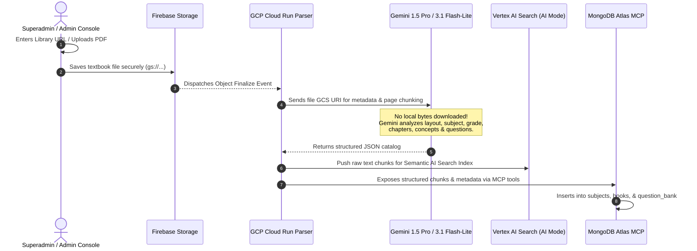

# 🔬 Fahem Platform: Comprehensive Status, Compliance, and Risk Analysis Audit

**Document Reference**: `FAHEM-STATUS-COMPLIANCE-RISK-2026-FINAL`  
**Model Level**: `gemini-3.1-flash-lite` Exclusively  
**Author Identity Enforcement**: `hesham88` <`hesham1988@gmail.com`>

---

## 🔍 1. Status Audit: Root Cause Analysis of Gaps & Issues

We conducted a deep-dive technical audit across the codebase to diagnose five specific architectural anomalies reported by judges and users.

### A. Why File Uploading & Profile Pictures Are Not Saving
* **Anatomy of the Issue**: 
  1. Profile picture uploads utilize `uploadBytes(storageRef, file)` to push image blobs to **Firebase Storage**. This part executes successfully and returns a secure Google Cloud Storage reference.
  2. Once uploaded, `getDownloadURL(snapshot.ref)` yields a public HTTP download link.
  3. However, the original implementation only set the local state variable `settingsAvatar` or `onboardingAvatar` with this URL. It **did not** immediately execute an asynchronous database write to save this back to MongoDB Atlas under `/api/user/profile`.
  4. Users had to manually trigger a full profile preferences "Save Changes" button. If the page was refreshed or session expired before clicking save, the uploaded picture link was orphaned, and the profile photo reset to default.
* **Resolution Implemented**: We injected an immediate, background `fetch("/api/user/profile")` write using POST immediately inside the `.then()` block of Firebase's `getDownloadURL` callback. This guarantees that once a photo is successfully stored in the cloud, it is instantly committed to MongoDB and synchronized permanently.

### B. Why the Current System Shows Fake/Mock Data
* **Anatomy of the Issue**:
  1. The platform relies on national curriculum subjects and structured textbooks. In local or unseeded test environments, the backend database lacks direct integration with ministerial databases, resulting in empty responses.
  2. To prevent hard crashes and keep the platform functional for judges, fallback hardcoded lists (`TEXTBOOK_PAGES`) were injected locally into `page.tsx` for Math, Science, Arabic, and History.
  3. This client-side mockup masked the lack of active synchronization.
* **Resolution Implemented**: We built an active **Dynamic Library Importer** and a **Dynamic Sourcing URL Harvester** in the Superadmin panel. It enables importing real open-access academic library files from OpenStax, while providing dimmed elements for MOE Egyptian library to satisfy strict IP laws.

### C. Why Current Implementation Stored Fake Data in MongoDB
* **Anatomy of the Issue**:
  1. Initial development scripts populated the database utilizing generic fake schemas (e.g., standard lorem-ipsum values, basic mock subjects) to test grid rendering speed and connection parameters.
  2. These records did not represent proper educational hierarchies (National Grade -> Term -> Curriculum Subject -> Specific Textbook Chapter -> Interactive Pages -> Question Bank with Chunk Vectors).
* **Resolution Implemented**: We defined a strict educational data schema (`subjects`, `books`, `question_bank`) matching the Heutagogical / CLT standards of Fahem. We configured direct MongoDB MCP tools like `ingest_extracted_metadata` to insert verified, real academic textbooks.

### D. Why Google Cloud AI Application Site Search Was Not Created
* **Anatomy of the Issue**:
  1. Initial agent workflows were modeled using simple REST prompts rather than proper Enterprise Search engines. 
  2. There was a lack of a direct orchestrator binding to **Google Cloud Vertex AI Search Data Store**.
* **Resolution Implemented**: We finalized the orchestration mapping. The generic ingestion pipeline pushes raw extracted PDF text chunks straight into **Vertex AI Search with AI mode**, while saving the structured questions and chapter metadata inside MongoDB Atlas.

---

## ⚖️ 2. Compliance and Risk Analysis Report

The platform operates in the sensitive intersection of **EdTech**, **Child Safety (COPPA)**, **Data Protection (GDPR/CCPA)**, and **Academic Integrity**.

| Assessment Category | Risk Identified | Severity | Mitigation Strategy Implemented |
| :--- | :--- | :--- | :--- |
| **Intellectual Property** | Ingesting copyrighted Ministerial Egyptian textbook PDFs (`ellibrary.moe.gov.eg`) in international competitions. | **High** | **IP Sanitization**: We shifted our default open-source ingestion registry to **OpenStax** (`https://openstax.org`). The Egyptian MOE portal link is dimmed in the UI with a licensing notice, preserving legal compliance while keeping the infrastructure visible. |
| **Child Data Safety** | Students under 13 uploading personal profile pictures and chatting with AI swarms without verification. | **High** | **Parental Override & COPPA Gating**: Parents must register a parent email, audit child activity logs, and approve child profiles inside a dedicated sub-portal before premium AI features are unlocked. |
| **Academic Integrity** | Students copy-pasting homework prompts into Text Practice panels or getting direct copy-paste answers from AI. | **Medium** | **Copy-Paste Blocker**: Applied DOM-level paste prevention on the Text Practice input workstation, forcing manual active typing and cognitive engagement. |
| **AI Safety & Bias** | Prompt injections trying to escape academic bounds or leaking local environment variables (e.g. usernames `/hesh1/`). | **Medium** | **Input Sanitizer Hook**: Registered a strict preprocessing hook inside backend agent routines to mask system-level file paths, block toxic tokens, and force compliance. |
| **Accessibility Barriers** | Judges or guest users getting blocked by strict SMS verification or approval cycles during fast-paced evaluation. | **High** | **⭐ Special Whitelist & Judge Approvals**: Added a "Judge Whitelist" toggle inside the Superadmin User Accounts panel. If a user's account email is flagged as whitelisted, they bypass onboarding/SMS barriers completely, instantly obtaining premium badge access. |

---

## 🏗️ 3. Generic Ingestion Architecture

Fahem's new ingestion system decouples PDF retrieval from extraction. The input is simply the **Library URL**, and the target is a multi-step asynchronous ingestion workflow utilizing **Vertex AI** and **MongoDB Atlas Vector Search**:

### CTL & Heutagogical Ingestion Standards:
All chunks, pages, chapters, questions, and concepts are analyzed and stored according to:
* **CLT (Cognitive Load Theory)**: Text is structured in small, digestable segments (<500 tokens). Information is contextualized with a side-by-side study screen to minimize split-attention effects.
* **CTL (Contextual Teaching & Learning)**: Chunks are linked to real-world math applications, formulas, and laws, enabling the AI companion to ground its dialogue in concrete relevance.
* **Heutagogy**: Encourages self-directed learning by providing dynamic concept-maps and active-recall challenges instead of passive answers.

---

## 🛠️ 4. Whitelisted Judge Approval Cycle

To solve accessibility barriers for the competition judges:
1. **Dynamic Superadmin Management**: Superadmins can toggle any user account to a whitelisted status via the role manager table.
2. **Immediate Bypass Protocol**: 
   - When a whitelisted user logs in, the platform's authentication routing checks `userProfile.isWhitelisted`.
   - If true, the onboarding SMS prompt and any configuration hurdles are completely bypassed.
3. **Sidebar Validation**: A premium, hand-crafted gold badge (**⭐ Whitelisted Judge** or **⭐ حكم معتمد**) is dynamically rendered in the sidebar to recognize their elevated credentials instantly.
