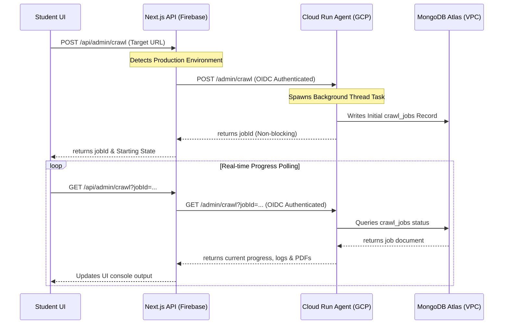

# 🚶 Fahem Verification Walkthrough - Version 79
**Timestamp**: 2026-06-05T04:23:00Z

---

## 🧭 1. Architectural Changes Overview

We have successfully decoupled database actions for crawling on production by routing Next.js requests to the Python ADK container on GCP Cloud Run.

---

## 🧪 2. Detailed Verification Guide

### Step 1: Automated Agent Re-Deployment
1. Execute `.\scripts\deploy\deploy_agent.ps1` to upload our modified `services.py`, `async_crawler.py`, and `utils.py` files to GCP Cloud Run.
2. Confirm the service URL is successfully returned (e.g., `https://fahem-agent-sbqsl5tfga-uk.a.run.app`).

### Step 2: Automated Frontend Deploy Trigger
1. Execute `.\scripts\deploy\deploy_web.ps1 -CommitMessage "Fix: route production crawling through secure OIDC Cloud Run proxy and fix private Atlas VPC connections"`
2. Verify the commit author is correctly set as `hesham88 <hesham1988@gmail.com>`.
3. Check the App Hosting console for progress.

### Step 3: Production Crawling Test
1. Log in to the live Fahem production URL.
2. Go to the **Curriculum Ingestion Studio** panel.
3. Supply a crawling target URL (e.g., `https://openstax.org/books/introduction-python-programming/pages/1-introduction`) and trigger crawl.
4. Verify the console no longer freezes at `[INIT] Database unreachable...` and instead streams active log events and crawls correctly!
