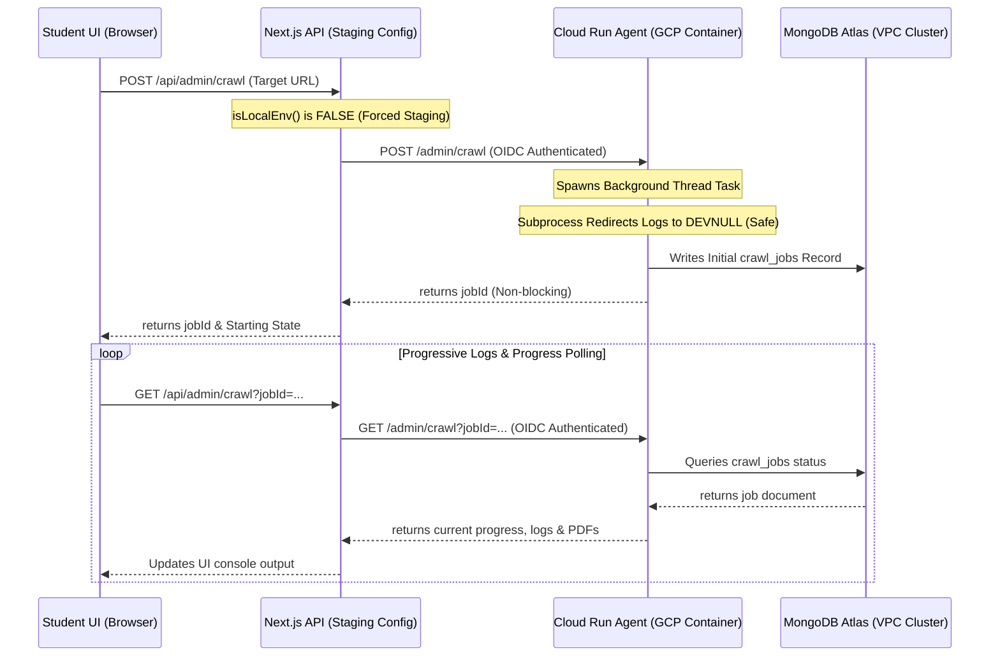

# 🚶 Fahem Verification Walkthrough - Version 80
**Timestamp**: 2026-06-05T05:20:00Z

---

## 🧭 1. Architectural Changes Overview

We have successfully decoupled database actions, aligned local development with the staging/delivery database configuration, and eliminated OS-level subprocess hangs:



---

## 🧪 2. Detailed Verification Guide

### Step 1: Verification of Staging/Delivery Behavior Locally
1. Run the local development server.
2. Navigate to the admin or ingestion sections.
3. Observe that all operations now bypass `local_db.json` and communicate directly with MongoDB Atlas via the secure Cloud Run routing proxy. Local and production environments are perfectly unified!

### Step 2: Full Deploy Execution
1. To compile, package, and deploy all updates, run the master deployment script:
   ```powershell
   .\scripts\deploy\deploy_all.ps1 -CommitMessage "Fix: crawler buffer saturation hang and enforce staging DB configuration"
   ```
2. This script:
   - Packages and deploys the backend container to GCP Cloud Run with our upgraded `DEVNULL` logging redirects.
   - Saves git identity, commits all modifications, and pushes the latest changes to GitHub.
   - Pushing triggers the automated Firebase App Hosting build and preview pipeline.

### Step 3: Production UI Cleanliness Verification
1. Access the updated preview/production app (e.g., `https://fahem--fahem-88d40.us-east4.hosted.app/en/home`).
2. Verify that **My Biology Summary Notes - Chapter 2** has been completely and permanently removed from the "My Study Vault" workspace.
