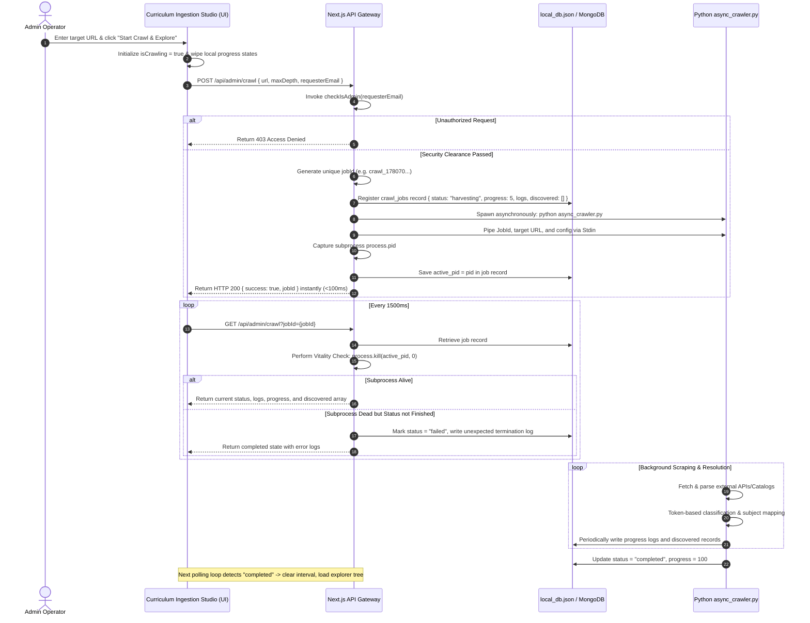
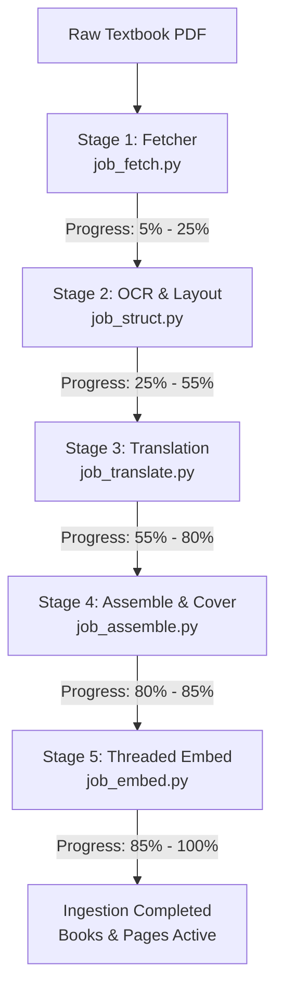

# Fahem Crawler, Interactive Directory Tree Explorer, and Sequential Multi-Stage Ingestion Pipeline

This document specifies the technical architecture, sequence of operations, data models, and dataflow pathways for the **Fahem Curriculum Crawler & Sequential Ingestion Pipeline (v2)**. It provides a formal blueprint for how external learning assets are discovered, mapped into structured educational hierarchies, ingested, chunked on block boundaries, vector-embedded using modern LLM capabilities, and served within the premium interactive book viewer.

---

## 1. High-Level Subsystem Architecture

The platform's asset-acquisition and curation ecosystem consists of three decoupled components:

```
┌────────────────────────────────────────────────────────────────────────────────────────┐
│                              Curriculum Ingestion Studio (UI)                           │
│     (Event-driven Progress Bars, Live Logging Pane, Interactive Directory Explorer)     │
└───────────────────────────┬─────────────────────────────────▲──────────────────────────┘
                            │ POST /api/admin/crawl           │ GET /api/admin/crawl?jobId=...
                            v                                 │ (Reactive polling loop)
┌─────────────────────────────────────────────────────────────┴──────────────────────────┐
│                            Next.js API Gateway (Local Dev)                             │
│     (Security Clearance, Admin Checks, Job Inception, Subprocess Spawning/Vitality)     │
└───────────────────────────┬────────────────────────────────────────────────────────────┘
                            │ spawn python scripts/async_crawler.py
                            v
┌────────────────────────────────────────────────────────────────────────────────────────┐
│                             Unified Adapter Crawler Engine                             │
│     (OpenStax CMS Paginator, MOE Catalog Fetcher, Generic Crawler BFS, Classifier)     │
└───────────────────────────┬────────────────────────────────────────────────────────────┘
                            │ writes to local_db.json & MongoDB (crawl_jobs)
                            v
┌────────────────────────────────────────────────────────────────────────────────────────┐
│                        Sequential Multi-Stage Ingestion Pipeline                        │
│    Fetch -> OCR/Layout Structuring -> Translation -> Assembly & Cover -> Parallel Embed │
└────────────────────────────────────────────────────────────────────────────────────────┘
```

---

## 2. Decoupled Subprocess Spawning Sequence

The Crawler and Ingestion pipelines are designed as non-blocking background OS processes to protect the core web application gateway from network latency, rate-limiting stalls, and blocking I/O constraints.

### Sequence Diagram: Pre-Ingestion Crawl & Discovery



---

## 3. Specialized Multi-Mode Harvesting Adapters

The background crawler adapts dynamically based on the starting domain signature to maximize discovery rates:

### A. OpenStax Adapter
Directly integrates with the live OpenStax CMS Wagtail API. Since a simple listing query returns books without download links, the adapter initiates concurrent detail resolution:
1. **Endpoint Resolution**: Performs HTTP `GET` against `/apps/cms/api/v2/pages/?type=books.Book`. Iterates through pagination pages to retrieve all book nodes.
2. **Detail Mapping**: For each node, retrieves `meta.detail_url` and triggers concurrent requests (governed by a `Semaphore(8)`) to extract the absolute `high_resolution_pdf_url` or `low_resolution_pdf_url`.
3. **Filtering**: Retains only entries containing direct downloadable PDF paths. Non-PDF books are categorized as web-only and skipped.

### B. Egyptian MOE Portal Catalog Fetcher
Replaces the static, hardcoded 13-book mock with a dynamic multi-source catalog retriever that fetches real live catalogs:
1. **Dynamic Catalog Scraping**: Fetches five distinct JSON catalogs published on `https://ellibrary.moe.gov.eg/`:
   - `books.json`
   - `books/books.json`
   - `sec3guideforms/books.json`
   - `cha/books.json`
   - `ExamSpecifications/books.json`
2. **Path Reconstruction**: Resolves relative paths into absolute Azure Blob Storage URLs, correcting syntax issues (e.g. `.pdf.pdf` double extensions).
3. **Deduplication**: Deduplicates books based on resolved PDF link signatures, yielding a real live directory catalog of 254+ active, high-resolution learning manuals.

### C. Generic BFS Fallback
For custom external domains, falls back to a bounded, same-host Breadth-First-Search (BFS) crawler:
- Extracts links using optimized regular expressions matching `<a href="...">`.
- Implements politeness throttling with a mandatory `0.8s` to `1.2s` rate-limiting delay between page fetches.
- Keeps PDF paths and auto-assigns titles by processing base file names.

---

## 4. Subject Auto-Classification Engine

To place discovered files into appropriate curriculum slots automatically, the engine runs a multilingual full-word token-matching classifier. 

To prevent substring matching bugs (such as matching "math" inside "polymath" or "it" inside "literature"), it splits the book's title and filename into clean words using Unicode regular expressions:
```python
words = set(re.findall(r'[a-z\u0600-\u06ff]+', title_or_filename.lower()))
```

Determines categories based on predefined keyword hashes:
- **Computer Science**: `computer, python, programming, software, coding, java, algorithms, c++, html, javascript, developer, scratch, it` -> Map to `sub_computer_science_1780535716963`
- **Pure Mathematics**: `math, algebra, trigonometry, calculus, stats, statistics, precalculus, geometry, prealgebra, linear algebra` -> Map to `subj_algebra_stats`
- **Physics & Chemistry**: `physics, chemistry, biology, science, anatomy, physiology, microbiology, nursing, pharmacology` -> Map to `subj_biology`
- **Arabic Grammar & Literature**: `arabic, grammar, literature, عربي, نحو, بلاغة, أدب, نصوص, لغة عربية` -> Map to `subj_arabic_grammar`
- **Business & Economics**: `business, economics, finance, accounting, management, marketing, entrepreneurship, ethics` -> Map to `subj_business`
- **Social Sciences & Humanities**: Default category, or matches `social sciences, humanities, history, psychology, sociology, success, philosophy` -> Map to `subj_social_sciences`

---

## 5. Structured 5-Stage Sequential Ingestion Pipeline

Once textbooks are selected, the sequentially linked multi-subprocess Python pipeline v2 triggers:



### Stage 1: Ingestion Fetcher (`job_fetch.py`)
Fetches raw assets from storage or external URLs. Saves documents locally, verifies file integrity, and extracts native Table of Contents outline bookmarks (`doc.get_toc()`).

### Stage 2: Layout OCR (`job_struct.py`)
Utilizes PyMuPDF (`fitz`) to rasterize pages to standard `DPI` PNG buffers. Calls the Vision API via the official `google-genai` SDK using `gemini-2.5-flash` with a strict Pydantic schema (`PageStructure`). Recovers layout grids, splits blocks into precise semantic classes, and outputs paragraph wraps, math-formula overlays, and callout matrices.

### Stage 3: Gemini Translation (`job_translate.py`)
Applies key-based machine translation over parsed layout blocks concurrently using `gemini-2.5-flash`, keeping structure intact and mapping dual English/Arabic languages under the page's `i18n` metadata dictionary.

### Stage 4: Outlines Compilation & DB Finalizer (`job_assemble.py`)
Aggregates chapter structures. If native PDF outlines are missing, it processes page topics sequentially and clusters pages dynamically based on chapter boundaries.
- **Glassmorphic Cover Generation**: Employs Pillow to render custom premium high-resolution cover graphics and thumbnails tailored to the subject palette. Saves assets under `/web/public/book_covers/{book_id}_full.png` and `_thumb.jpg`.
- **Mind Map Synthesis**: Constructs interactive hierarchy trees (Nodes and Links) based on chapter outlines for spatial navigation.

### Stage 5: Parallel Threaded Embed (`job_embed.py`)
Prepares high-fidelity vectors for vector search:
1. **Parallel Workers**: Launches a concurrent `ThreadPoolExecutor` gated at `max_workers = 3` (avoiding Gemini API rate limit restrictions) to process book pages in parallel, drastically reducing embedding latency from hours to minutes.
2. **Context-Aware Chunking**: Builds heading path hierarchies (e.g. `Chapter 2 › Section 2.3 › `) and prepends them to chunks before embedding, preserving topological context.
3. **Resilient API Handling & Fallbacks**: Calls `gemini-embedding-2` for 3072-dimensional vector representations.
   > [!IMPORTANT]
   > To prevent catastrophic ingestion failures and rollbacks, all embedding API calls are wrapped in `try-except` blocks. If an API call fails or times out, the system automatically falls back to deterministic SHA256 offline hashing without terminating the pipeline.
4. **Thread-Safe DB Sync**: Writes finalized records safely to the database utilizing thread-safe locks (`db_write_lock`). Updates subject metrics and triggers ingestion completion.

---

## 6. Database Collection Schemas

Discovered assets and ingested manuals map directly onto three collection indices inside MongoDB:

### Collection: `crawl_jobs`
```json
{
  "_id": "crawl_1780706857136_x9p3r",
  "url": "https://ellibrary.moe.gov.eg/",
  "status": "completed",
  "progress": 100,
  "active_pid": 14382,
  "logs": [
    "[INIT] 🚀 Spawning isolated GCP Cloud Run Harvester...",
    "[INFO] Fetching real MOE catalog records...",
    "[COMPLETE] ✅ Discovered 254 textbook documents mapped successfully."
  ],
  "discovered": [
    {
      "id": "disc_8a1e2f9c",
      "title": "Algebra and Solid Geometry",
      "titleAr": "الجبر والهندسة الفراغية",
      "url": "https://elearnningcontent.blob.core.windows.net/elearnningcontent/.../Algebra_Sec3.pdf",
      "fileName": "Algebra_Sec3.pdf",
      "totalPages": 220,
      "bookType": "core",
      "grade": "Grade 12",
      "term": "Term 1",
      "year": "2026",
      "language": "ar",
      "subject": "Pure Mathematics",
      "subjectId": "subj_algebra_stats"
    }
  ],
  "created_at": 1780706857.136,
  "updated_at": 1780710324.944
}
```

### Collection: `books`
```json
{
  "_id": "book_python_real_test",
  "subject_id": "sub_computer_science_1780535716963",
  "title": "Introduction to Python",
  "title_ar": "مقدمة في لغة بايثون",
  "source_url": "https://example.com/python.pdf",
  "storage_path": "admin_uploads/book_python_real_test.pdf",
  "grade": "Grade 11",
  "term": "Term 1",
  "year": "2026",
  "language": "en",
  "book_type": "core",
  "userId": "admin_operator",
  "coverUrl": "/book_covers/book_python_real_test_full.png",
  "coverThumbUrl": "/book_covers/book_python_real_test_thumb.jpg",
  "status": "structured",
  "chapters": [
    {
      "title": "Chapter 1: Getting Started",
      "title_ar": "الفصل 1: البداية",
      "startPage": 1,
      "endPage": 12
    }
  ],
  "mindMap": {
    "nodes": [
      { "id": "ch1", "label": "Chapter 1: Getting Started", "type": "chapter" }
    ],
    "links": []
  },
  "updated_at": 1780727218.816
}
```

### Collection: `book_pages`
```json
{
  "_id": "page_book_python_real_test_1",
  "book_id": "book_python_real_test",
  "page_number": 1,
  "dir": "ltr",
  "blocks": [
    {
      "id": "b1",
      "type": "heading",
      "text": "1.1 Introduction",
      "level": 1
    },
    {
      "id": "b2",
      "type": "paragraph",
      "text": "Python is a modern interpreted high-level language designed for readability."
    }
  ],
  "i18n": {
    "ar": {
      "b1": { "text": "1.1 مقدمة" },
      "b2": { "text": "بايثون هي لغة برمجية مفسرة حديثة عالية المستوى تم تصميمها لتسهيل القراءة وفهم التعليمات البرمجية." }
    }
  },
  "formulas": [],
  "concepts": ["Introduction", "Python"],
  "embedding": [0.0142, -0.0452, 0.0812],
  "status": "embedded",
  "updated_at": 1780727218.816
}
```

---

## 7. Next.js Book Viewer State Hydration

To ensure the high-fidelity page blocks and translated segments are rendered cleanly inside the interactive view, Next.js server-side queries map attributes fully within the home router layout.

The gateway queries all page objects using `getAllPages` inside `web/src/app/[locale]/home/page.tsx` and mirrors values directly into the reader panel. By preserving both `blocks` and `i18n` keys, the frontend is successfully hydrated, allowing the glassmorphic block layouts and multilingual overlay layers to render flawlessly.
