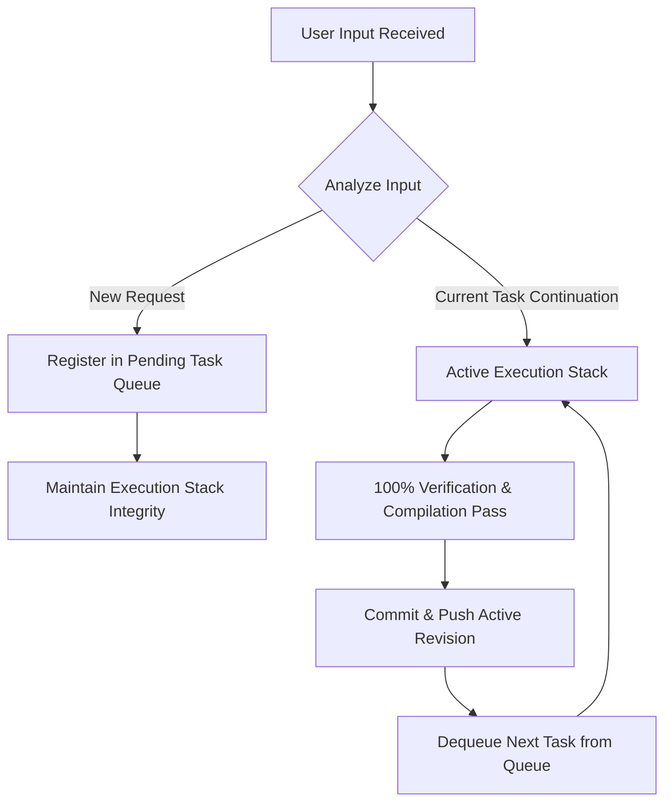

# Fahem Multi-Task Focus and Structured Collaboration Protocol
**Active Revision**: v1.0
**Timestamp**: 2026-05-29T20:25:00+03:00

## 1. Objective
Ensure absolute cognitive persistence, multi-task focus tracking, and granular step-by-step execution visibility during intense, high-context agentic development. Under no circumstance should parallel tracks (e.g., user profiles, database persistence, parent panels, security dashboards, audit records) be forgotten, dismissed, or lost between conversation compactions.

---

## 2. The Multi-Task Processing Queue Algorithm
Whenever the User prompts with a new focus, feature request, or directional change during an active task:
1. **Intercept & Register**: Intercept the incoming prompt and immediately register it as a pending item in the `Pending Task Queue`.
2. **No Context Disruption**: Do NOT drop, dismiss, or compromise the current active thread of implementation.
3. **Atomic Execution**: Complete the active task (atomic code edits, compilation tests, lint checks, compliance audits, and pushes) first.
4. **Queue Transition**: Only after the current task achieves 100% verification, transition to the next item in the queue.
5. **State Synchronization**: On every transition, read previous workspace files, database schemas, and session telemetry to synchronize the state and prevent context drift.

---

## 3. Mandatory Reporting Protocol (The Collaboration Standard)
At the end of **every single turn**, the Agent must output a three-tier structured communication block directly to the User in the chat. This ensures perfect reporting transparency:

### I. SUMMARY
*A concise, high-level, human-friendly narrative summarizing what was requested, why decisions were made, and the strategic accomplishments of the turn.*

### II. DETAILED REPORT
A systematic, technical breakdown of all files, databases, collections, and pipeline states:
*   **Database Operations**: Records of standard MCP tool invocations (`insert-many`, `update-many`, `create-index`, `find`).
*   **Code Modifications**: File-by-file accounting of additions or modifications (with links to modified lines).
*   **Pipeline & Build Metrics**: Verification of local static compilations, build times, and continuous deployment triggers.
*   **Compliance Status**: Explicit findings from the automated audit sweep (`evaluate_compliance.py`).

### III. QUICK SHORT RECAP
*A high-density, bulleted list representing the exact state of active features, finished tasks, pending queue items, and immediate next steps.*
- ✅ **Finished Tasks**: List of finalized features.
- ⏳ **Active Execution**: Current thread.
- 📋 **Pending Queue**: Tasks registered for next execution.
- 🚀 **Next Milestone**: Immediate target.
