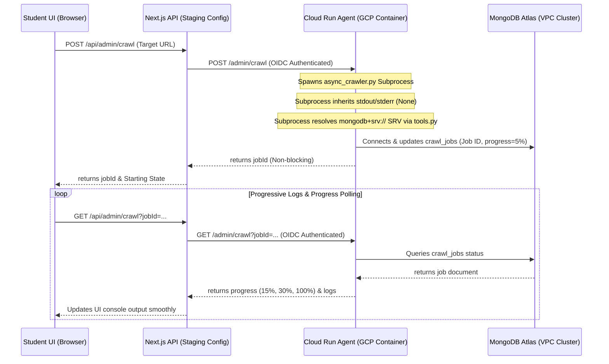

# 🚶 Fahem Verification Walkthrough - Version 81
**Timestamp**: 2026-06-05T05:37:00Z

---

## 🧭 1. Architectural Changes Overview

We have integrated robust public DNS SRV resolution for child processes, enabled standard container logging stream inheritance, and added strict traceback propagation:



---

## 🧪 2. Detailed Verification Guide

### Step 1: Verification of Compliance Audit
1. Run `python scripts/evaluate_compliance.py` and verify that all security, committer, and memory checks pass successfully.

### Step 2: Cloud Run Agent Microservice Redeployment
1. Deploy the python agent microservice to Cloud Run:
   ```powershell
   .\scripts\deploy\deploy_agent.ps1
   ```
2. Wait for the command to finish. Verify that the service builds successfully and displays the service URL.

### Step 3: Run Live Crawl Ingestion Verification
1. Open the live platform UI at `https://fahem--fahem-88d40.us-east4.hosted.app/en/home`.
2. Navigate to **Curriculum Studio**.
3. Under **Curriculum Crawler & Web Exploration Studio**, set the target domain to `https://openstax.org`.
4. Click **Crawling educational nodes...**.
5. Observe the progress bar and real-time logs updating dynamically past 5% (to 15%, 30%, and 100%) and loading books cleanly into the curriculum categories without any hangs.
