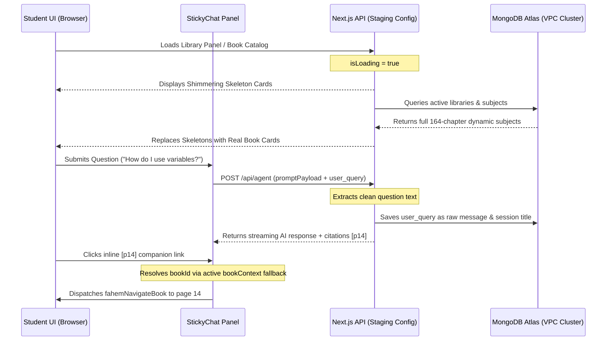

# 🚶 Fahem Verification Walkthrough - Version 82
**Timestamp**: 2026-06-18T04:56:30+03:00

---

## 🧭 1. Architectural Changes Overview

We have resolved interface regressions, robotic history formatting, and citation routing:



---

## 🧪 2. Detailed Verification Guide

### Step 1: Execute Guard Local Sweeps
1. Run the local sweep script to ensure all access gates and control criteria are 11/11 green:
   ```powershell
   .\guard.bat sweep
   ```

### Step 2: Verify Friendly Chat History Titles
1. Open StickyChat and enter a question.
2. Ask any question in English or Arabic (e.g. "Explain lists").
3. Inspect the sidebar chat history.
4. Verify the session is titled "Explain lists" or similar, without any robotic system tags, RAG references, or JSON brackets.

### Step 3: Verify Page Citations Deep-Linking
1. Open any textbook in the book page viewer.
2. Open StickyChat (which now tracks the loaded book's `bookContext`).
3. Ask a question regarding the current content.
4. Once the AI cites pages with `[pN]`, click on the page citation.
5. Verify the reader automatically slides and navigates directly to the designated page.

### Step 4: Visual Latency Feedback
1. Navigate to the **Knowledge Library**.
2. Observe the instant shimmer grids appearing immediately upon tab toggle, giving highly premium interactive indications while subjects are loaded.
