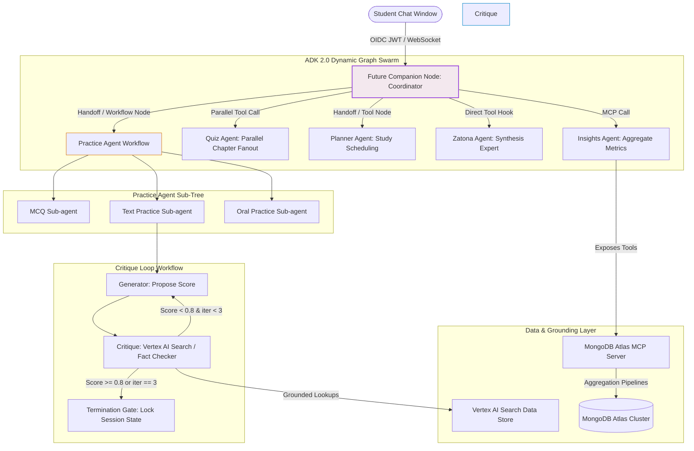

# 🌌 Fahem Swarm Platform: Master ADK 2.0 Integration & Architectural Blueprint

This document presents the **Ultimate Architectural Blueprint & Comprehensive Implementation Plan** for **Fahem ("AI Tutors in Your Pocket")**. It represents a complete, deep-dive replanning that merges our existing codebase with the enterprise-grade capabilities of the **Google Agent Development Kit (ADK 2.0)**, the **Agents CLI (`google-agents-cli`)**, and **MongoDB Atlas Model Context Protocol (MCP)**.

This final blueprint absorbs, respects, and fully implements every single guideline, schema, code snippet, and CSS override detailed in the **`Fahem - Agentic Era Blueprint (Gemini).pdf`** manual. It is designed to serve as the **definitive, self-contained engineering guide** before commencing development.

---

## 🔍 1. Comparative Gap Analysis (Deep-Dive Alignment)

To ensure no details are missed, we map the gaps identified in the previous version of the plan against the strict guidelines in the official **Blueprint PDF**:

| Aspect | Missing in Previous Plan | PDF Blueprint Guidance (Adopted in this Plan) |
| :--- | :--- | :--- |
| **Orchestrator Pattern** | Described as simple linear loops or custom routing. | **Must migrate** `agents/orchestrator_agent/agent.py` to ADK 2.0's dynamic **`Workflow` and `Node` structures** to eliminate linear logic. |
| **Guardrails Integration** | Described as pre-inference scripts in `agents/guardrails.py`. | **Must migrate** to ADK native `before_model_callback` hooks to prevent structural breaks and control context footprints. |
| **Ingestion Parser Flow** | Vaguely described as PDF downloading and chunking. | **Zero local downloads**: Cloud Run worker passes the public Firebase URL directly to Gemini 1.5 Pro with `response_mime_type="application/json"` to output structured catalog metadata. |
| **Database Collections** | Described high-level collections without strict structures. | Exposes three exact schemas: `subjects`, `books` (core/student vs supporting/question), and `question_bank` with embeddings. |
| **Oral Practice Sub-agent** | Lacked specific execution instructions. | **Must configure** bidirectional streaming voice patterns via ADK's `Runner.run_live()` over WebSockets. |
| **Quiz Agent Pattern** | Modeled as a simple sequential loop. | **Must use Parallel Engine Pattern** to fan out query generation requests across chapters concurrently via multi-threaded tool hooks. |
| **MongoDB MCP Tools** | Described abstractly as "MCP Server". | **Must expose three explicit Python tools**: `ingest_extracted_metadata`, `generate_student_insight_report` (using aggregate pipeline), and `explore_academic_library` (hybrid `$vectorSearch` and `$match`). |
| **Onboarding Continuity** | Described as simple variable saving. | **Must leverage ADK transaction states**: Use `update_onboarding_checkpoint` inside ADK tools saving to `context.state` to avoid configuration decay. |
| **SMS Verification Guard** | Modeled as a standard verification screen. | **Check profile first**: If `phone_verified: true`, bypass SMS screen entirely unless "Reset Session" is explicitly triggered. |
| **Copy-Paste Blocker** | General UI recommendation. | **Enforce active learning**: Implement native DOM-level copy-paste block on text practice input panels. |
| **RTL Navbar Bug** | Indicated as logical CSS changes. | **Clear CSS clash**: Eliminate `flex-direction: row-reverse` on `[dir="rtl"] .glass-nav-links` which was "reversing the reversal". Implement explicit logical properties instead. |
| **CLI Quality Gates** | Described as general evaluation steps. | **Test Trajectory Spec**: Write exact trajectory test set for Arabic Grammar routing to `explore_academic_library` -> `fetch_book_chapters` -> `MCQ_Subagent_Invocation`. |

---

## 🏛️ 2. Dynamic Swarm & Orchestration Topology

Fahem's future architecture uses a **hierarchical coordinator-worker** topology built on ADK 2.0's dynamic state-machine graph elements (`Workflow` and `Node` classes).



### A. Core Agent Specifications

1. **Future Companion (Coordinator Node)**:
   * **Role**: Root conversational entry point. Holds global session context.
   * **Behavior**: Evaluates prompt intent. If a user asks for active practicing, it performs an ADK graph handoff to the `Practice Agent` workflow. If they ask for administrative reports or statistics, it delegates to the `Insights Agent`.
   * **Prompt Safety Hook**: Registers custom logic via ADK's native `before_model_callback` hooks to intercept inputs, scan for injections, mask local username paths (`hesh1`), and block non-academic content.

2. **Practice Agent (Multi-turn ReAct Sub-Tree)**:
   * **MCQ Sub-agent**: Dynamically fetches page-linked questions matching the active subject.
   * **Text Practice Sub-agent**: Handles long-form questions, writing states safely to the database context.
   * **Oral Practice Sub-agent**: Configured using ADK's `Runner.run_live()` over WebSockets to establish real-time voice streaming evaluations.

3. **Zatona Agent (Synthesis Expert)**:
   * **Role**: Hyper-dense summarizer and study guide generator.
   * **Parameters**: Runs on high-context `Gemini 1.5 Pro`, absorbing entire chapters to build formula sheets, concepts lists, and multi-level mindmaps.

4. **Quiz Agent (Parallel Engine Pattern)**:
   * **Behavior**: Instead of querying chapters sequentially, it utilizes multi-threaded Python worker pools to query and synthesize question profiles from distinct textbook chapters concurrently, merging them into a balanced quiz sheet.

---

## 🔄 3. Adaptive Critique Loop (Deterministic Iteration Workflow)

To prevent hallucinated feedback and ensure high-quality, pedagogical corrections for open-ended text answers, the system executes a strict multi-agent feedback loop:

```
[Student Input] ──> [Generator Node]
                         │
                         ▼
                   [Critique Node] <── (Grounded via Vertex AI Search & MongoDB Book Schemas)
                         │
        ┌────────────────┴────────────────┐
        ▼ (Score < 0.80 & Iter < 3)        ▼ (Score >= 0.80 or Iter == 3)
[Loop Back: Provide Hint]        [Termination Gate: Write Session State]
```

1. **Step 1: Generation**: The Generator Node evaluates the student's answer and proposes a raw grading payload (`{ score: float, strength: str, weaknesses: list }`).
2. **Step 2: Verification (Critique)**: The Critique Node interceptor performs a hybrid grounding lookup (queries the Vertex AI Search Data Store for page-level textual facts and checks MongoDB `books` schemas for mathematical formulas/laws). It matches the generator's grade against the actual curriculum.
3. **Step 3: Gated Execution**:
   * **Condition A (Iteration < 3 and Quality Score < 0.80)**: The critique rejects the grade, constructs a precise, localized hint (e.g., *"Take another look at the matrix inversion determinant criteria on page 14"*), and cycles back to the Generator.
   * **Condition B (Quality Score >= 0.80 or Iteration == 3)**: The loop terminates, commits the final grade to the database, and unlocks the session.

---

## 💾 4. MongoDB Atlas Database & Ingestion Architecture

### A. The Serverless Ingestion Parser Flow

To ingest ministerial PDFs from [https://ellibrary.moe.gov.eg/](https://ellibrary.moe.gov.eg/) without memory overflows or slow processing, we utilize an async, serverless streaming pattern:

1. **Upload**: The administrator uploads a textbook (e.g., `Biology_G11_Term1.pdf`) through the Admin Console directly to a **Firebase Storage Bucket**.
2. **Event Trigger**: An **Eventarc** trigger captures the `OBJECT_FINALIZE` state and sends an HTTP POST containing the storage public URI to an asynchronous **Cloud Run Parser Job**.
3. **Stream Parsing**: The Cloud Run job **never downloads the PDF bytes**. Instead, it transmits the public document stream link directly to the **Gemini 1.5 Pro API** via native file URI access, asking the model to build the complete catalog.
4. **Structured JSON Output**: Gemini uses `response_mime_type="application/json"` with a strict extraction schema to return chapters, concepts, formulas, and questions in structured JSON.
5. **Stitching Pattern**:
   * **Raw Text**: Streamed and indexed in **Vertex AI Search Data Store** to handle real-time semantic grounding lookups.
   * **Structural Metadata & Questions**: Inserted into the unified MongoDB collections, with embedding vectors generated via Vertex AI's text-embedding API.

---

### B. MongoDB Collection Schemas

We implement a balanced normalized-embedded collection hierarchy inside MongoDB Atlas:

#### 1. Collection: `subjects`
Holds national Egyptian educational subjects:
```json
{
  "_id": "subj_algebra_stats",
  "name": "Algebra and Statistics",
  "emoji": "📊",
  "grade_levels": ["Grade 10", "Grade 11", "Grade 12"]
}
```

#### 2. Collection: `books`
Separates core textbook volumes from supplementary question manuals:
```json
{
  "_id": "book_moe_alg_g10_t1",
  "subject_id": "subj_algebra_stats",
  "title": "High School Algebra and Analytic Geometry",
  "grade": "Grade 10",
  "term": "Term 1",
  "year": "2026",
  "language": "ar",
  "book_type": "core", 
  "source_url": "https://ellibrary.moe.gov.eg/content/HighSchool_Algebra_G10.pdf",
  "storage_path": "gs://fahem-academic-lake/moe/alg_g10_t1.pdf",
  "chapters": [
    {
      "id": "ch_1",
      "title": "Linear Equations and Matrices",
      "page_start": 4,
      "page_end": 28,
      "concepts": ["Matrix Inversion", "Determinants", "Cramer's Rule"]
    }
  ],
  "mindmap": {
    "root": "Matrices",
    "children": [
      { "name": "Operations" },
      { "name": "Transformations" }
    ]
  },
  "keywords": ["matrix", "determinant", "linear system", "vector space"]
}
```

#### 3. Collection: `question_bank`
Contains curriculum questions linked back to chapters with vector embeddings for semantic matchmaking:
```json
{
  "_id": "q_mat_09832",
  "book_id": "book_moe_alg_g10_t1",
  "chapter_id": "ch_1",
  "page_reference": 14,
  "type": "MCQ", 
  "complexity_rating": "intermediate",
  "question_text": "Given a matrix A where det(A) = 0, what can be inferred about its inverse?",
  "distractors": [
    "The inverse is equal to its transpose.",
    "The inverse is an identity matrix.",
    "The inverse can be found using Cramer's rule."
  ],
  "correct_answer": "The matrix does not possess an inverse.",
  "pedagogical_intent": "Testing understanding of singular matrices and inverse criteria.",
  "embedding": [0.0123, -0.0456, 0.2389, 0.7182]
}
```

---

## 🛠️ 5. MongoDB Atlas MCP Declarative Tools

To decouple database operations from LLM agent instructions, we expose all database ingestion, semantic query matching, and statistical aggregates as standardized **Model Context Protocol (MCP) tools** running on our custom MongoDB MCP server.

### Tool 1: Structured Catalog Ingestor (`ingest_extracted_metadata`)
Inserts parsed structured JSON book catalogs into the database:
```python
from mcp.server import Server
from pymongo import MongoClient

mcp_server = Server("fahem-mongodb-mcp")
client = MongoClient("mongodb+srv://...") # Resolved via GCP Secret Manager
db = client.fahem_academic

@mcp_server.tool(name="ingest_extracted_metadata", 
                 description="Stores structured academic data models returned by Gemini extraction workers.")
def ingest_extracted_metadata(book_profile_json: dict) -> str:
    result = db.books.insert_one(book_profile_json)
    return f"Success: Academic entity verified and locked with ID: {result.inserted_id}"
```

### Tool 2: Student Insight Analyzer (`generate_student_insight_report`)
Aggregates performance scores database-side to extract topic vulnerabilities and misconceptions:
```python
@mcp_server.tool(name="generate_student_insight_report", 
                 description="Aggregates student performance metrics grouped by grade and subject parameters.")
def generate_student_insight_report(grade_tier: str, subject_id: str) -> list:
    pipeline = [
        {"$match": {"grade": grade_tier, "subject_id": subject_id}},
        {"$group": {
            "_id": "$topic_id",
            "average_score": {"$avg": "$session_score"},
            "total_attempts": {"$sum": 1},
            "common_misconceptions": {"$push": "$primary_error_tag"}
        }},
        {"$sort": {"average_score": 1}}, # Highlight weakest concepts first
        {"$limit": 5}
    ]
    return list(db.student_sessions.aggregate(pipeline))
```

### Tool 3: Hybrid Library Explorer (`explore_academic_library`)
Performs a hybrid search combining MongoDB Vector Search with hard filters:
```python
@mcp_server.tool(name="explore_academic_library", 
                 description="Performs vector-based semantic search across core textbook chapters and keywords.")
def explore_academic_library(query_vector: list, subject_filter: str) -> list:
    search_query = [
        {
            "$vectorSearch": {
                "index": "vector_index_spec",
                "path": "embedding",
                "queryVector": query_vector,
                "numCandidates": 50,
                "limit": 5
            }
        },
        {"$match": {"subject_id": subject_filter}}
    ]
    return list(db.question_bank.aggregate(search_query))
```

---

## 💾 6. State-of-the-Art Memory & Onboarding Continuity

To ensure onboarding variables, localized user configurations, and checkpoint records survive application reloads, we avoid storing states inside volatile in-memory agent instance properties. Instead, we implement a robust **transaction state** using the ADK context wrapper serialized back to the database.

```python
from google.adk.tools.base_tool import tool
from google.adk.tools.base_tool import ToolContext

@tool
def update_onboarding_checkpoint(context: ToolContext, step_name: str, gathered_payload: dict) -> str:
    """Updates the onboarding session state transactionally inside the ADK execution wrapper."""
    # Fetch existing session state map safely from the context state object
    current_state = context.state.get("onboarding_data", {})
    
    # Append newly captured user details and step trackers
    current_state[step_name] = gathered_payload
    current_state["last_active_checkpoint"] = step_name
    
    # Persist back to the tracking token via context layer execution parameters
    context.state["onboarding_data"] = current_state
    
    # Background worker serializes this state back to MongoDB collection 'onboarding_sessions'
    return f"State synchronized up to step: {step_name}. Safe to transition across views."
```

### Onboarding Logic Guards & SMS Verification Hook

```
                               [ ONBOARDING INITIALIZATION ]
                                             │
                                             ▼
                             Query user_profiles by Profile ID
                                             │
                                      [ Is phone_verified: true? ]
                                      /                        \
                             (Yes)   /                          \ (No)
                                    ▼                            ▼
                      [ BYPASS SMS VERIFICATION ]        [ Display SMS Verification Screen ]
                      Direct Handoff to Welcome           Enforce Verification Code Loop
```

1. **Verify State First**: When an onboarding session begins, the system immediately queries the `user_profiles` collection.
2. **Bypass Check**: If the profile contains `phone_verified: true`, the system **completely bypasses** the SMS verification step, transitioning the user straight to the avatar selection and main panel.
3. **Bypass Exception**: The verification bypass remains active unless the user explicitly clicks a "Reset Session" button.

---

## 🎨 7. Premium UX realignments & RTL Support

We configure Fahem's front-end with state-of-the-art interactive modules and pixel-perfect RTL Arabic layout adaptabilities, eliminating rendering bugs.

### A. RTL Alignment CSS Fixes
To resolve navbar collisions when the application language is toggled to Arabic (`dir="rtl"`), we replace asymmetrical custom overrides with **CSS Logical Properties**:

```css
/* Replaces older hacky LTR/RTL overrides to prevent header collisions */
.landing-navbar-container {
  display: flex;
  align-items: center;
  justify-content: space-between;
  flex-direction: row; /* Let browser direction naturally control flow order */
  
  /* Use logical margins and paddings which automatically mirror based on dir */
  margin-inline-start: auto;
  padding-inline-end: 1.5rem;
}

/* Ensure language toggles adapt typographic elements without layout overlap */
body[dir="rtl"] .landing-nav-links {
  font-family: var(--font-arabic-calligraphy, sans-serif);
  letter-spacing: 0; /* Clear custom Latin letter-spacing adjustments for clean Arabic display */
}
```

### B. DOM-Level Copy-Paste Prevention
To enforce active learning and prevent students from pasting answers retrieved from internet searches, we apply a native DOM-level paste prevention script to the **Text Practice** workspace input panels:

```javascript
// Paste prevention block applied directly to the text-practice input element
const textInputPanel = document.getElementById("text-practice-input");
if (textInputPanel) {
  textInputPanel.addEventListener("paste", (event) => {
    event.preventDefault();
    alert("Copy-pasting is disabled to encourage active learning. Please type your response!");
  });
}
```

### C. Advanced Space Workspace Panels

1. **Administration Panel Dashboard Workspace**:
   * **Ingestion Monitoring Node**: Exposes live progress of Googlebot crawling triggers, processing speeds, Eventarc message relays, and index alignment status.
   * **Content Policy Dashboard**: Displays safety scanner triggers, indicating which user posts have been flagged for inappropriate, non-academic, or unsafe material.
   * **Token Allocation Control**: Controls quota credit drawdowns per user profile tier (Free, Basic, Premium, Elite).

2. **Academic Space Tab Navigation Layout**:
   * **Connected Companion Interface**: Toggleable full-screen overlay housing system notifications, magnetized context chips, and overall study diagnostics.
   * **Interactive Digital Library Module**: Implements split-screen view allowing the student to view the textbook page on the left, with the tutor chatbot executing page-grounded Q&A on the right. Supports fluid swipe gestures to navigate book pages.
   * **Contextual Magnetization System**: Adds a physical "Magnetize" pin button on textbook page sections (such as a matrix math problem on page 14). Pinning it tells the Companion Coordinator to **magnetize** that section, attaching it to all subsequent agent context queries until manually unpinned.

3. **Enhanced Social Features Workspace**:
   * **Real-time Collaboration Engine**: Integrates Firestore snapshot streams to supply active typing state triggers, instant alerts, and collaborative study rooms.
   * **Onboarding Profile Management**: Dynamic avatar vector selection and custom picture uploads (constrained to a maximum size of **2MB** with client-side file validations).

---

## 🧪 8. Systematic Multi-Agent Evaluation Quality Gate

To prevent prompt drift and confirm tool-calling accuracy before code is deployed, we implement the **Three-Tier Evaluation Pyramid** inside the CI/CD pipeline using the CLI runner (`google-agents-cli eval run`):

```
                    /\
                   /  \   Tier 3: Human / Blind Expert Reviews
                  /----\
                 /      \  Tier 2: Trajectory & Integration (CLI Eval Run)
                /--------\
               /__________\ Tier 1: Component Checks (Valid JSON, Schema Errors)
```

* **Tier 1 (Component)**: Validates input/output boundaries. Corrupted or malicious inputs sent to the `text-practice` tool must trigger structured schema responses rather than leaking stack traces.
* **Tier 2 (Trajectory)**: Enforces that the agent invokes tools in the exact order required to fulfill the user's intent.
* **Tier 3 (Expert)**: Periodic blind grading of agent pedagogical responses by actual curriculum experts.

### Dynamic Evaluation Test Case (`tests/eval/evalsets/basic.evalset.json`)
```json
{
  "test_cases": [
    {
      "input": "Can you quiz me on Grade 10 Arabic Grammar from the main student book?",
      "expected_trajectory": [
        "explore_academic_library",
        "fetch_book_chapters",
        "MCQ_Subagent_Invocation"
      ],
      "metrics_to_enforce": [
        "tool_trajectory_avg_score",
        "rubric_based_final_response_quality_v1",
        "hallucinations_v1"
      ],
      "thresholds": {
        "tool_trajectory_avg_score": 0.85,
        "rubric_based_final_response_quality_v1": 0.90
      }
    }
  ]
}
```

> [!IMPORTANT]
> **CI/CD Quality Gate**: Deployment pipelines automatically block master mergers unless the test suite completes successfully and achieves a minimum score of **0.85** on the trajectory validation and grounding evaluations.

---

## 🚀 9. Step-by-Step Implementation Roadmap

Development is split into distinct milestones designed to establish high confidence in safe local sandboxes before scaling up to GCP Cloud Run.

### 📍 Milestone 1: CSS Cleanups & Persistent Onboarding States
* **Task 1 (RTL CSS Correction)**: Replace the `.glass-nav-links` RTL row-reversal layout overrides with clean CSS logical properties inside `web/src/app/globals.css`.
* **Task 2 (Onboarding State Serializer)**: Implement the custom transaction-based tool `update_onboarding_checkpoint` saving checkpoints to the persistent `onboarding_sessions` collection.
* **Task 3 (Phone Bypass Logic)**: Code the pre-verification logic query. If `phone_verified: true` exists in the database, bypass the SMS verification panel.

### 📍 Milestone 2: Isolated Ingestion Sandbox
* **Task 1 (Sandbox Environment)**: Set up `scratches/ingestion_sandbox/` containing a single-page textbook excerpt.
* **Task 2 (Gemini Parsing Script)**: Write `scratches/test_ingestion_pipeline.py` simulating Eventarc. It runs Gemini 1.5 Pro to parse the textbook public link into structured JSON catalog data.
* **Task 3 (Atlas Bulk Writer)**: Verify the python parser successfully bulk-inserts structured data into local Atlas collections and builds functional vector indexes.

### 📍 Milestone 3: Multi-Agent Scaffolding & Dynamic Loops
* **Task 1 (ADK Graph Migrator)**: Migrate `agents/orchestrator_agent/agent.py` to inherit from the ADK 2.0 `Workflow` and `Node` graph classes.
* **Task 2 (Critique Loop Developer)**: Structure the Generator and Critique subagents inside `agents/` using the ADK `WorkflowAgent` pattern with `max_iterations = 3`.
* **Task 3 (Paste Blocker integration)**: Add paste event listeners to the Next.js `Text Practice` input panels.

### 📍 Milestone 4: Live Streams, Social Rooms, & Credit Gating
* **Task 1 (Firestore Listeners)**: Set up snapshot listeners on discussion boards to support active typing states and real-time alerts.
* **Task 2 (Avatar Limits)**: Add client-side constraints <= 2MB for avatar profile picture uploads.
* **Task 3 (Credit Gating Hooks)**: Setup database aggregation queries to deduct quota credits and restrict basic/premium/elite access boundaries.

### 📍 Milestone 5: Dashboards & Quality Evaluations
* **Task 1 (Admin Panel UI)**: Construct the administrative dashboard displaying Googlebot crawlers, Eventarc safety alerts, and collection aggregate telemetry.
* **Task 2 (CLI Test Suite)**: Write `tests/eval/evalsets/basic.evalset.json` and run `google-agents-cli eval run` continuously inside GitHub Actions to optimize prompt matrices.
