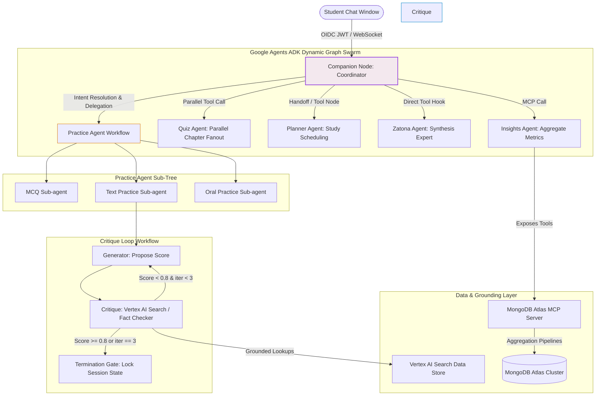
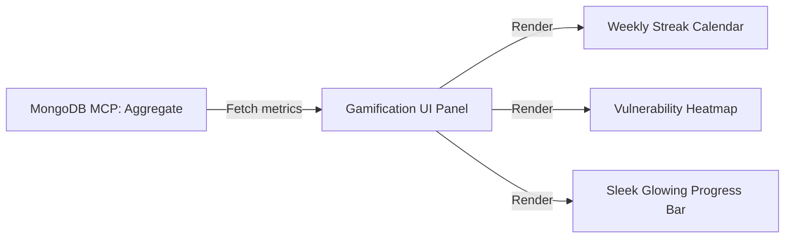

# 🌌 Fahem Swarm Platform: Unified Master ADK Plan & Architectural Blueprint

**Document Reference**: `FAHEM-SWARM-METAFRAMEWORK-3.0-FINAL`  
**Core Model Standard**: `gemini-3.1-flash-lite` Exclusively  
**Database Protocol**: MongoDB Atlas Model Context Protocol (MCP)  
**Hosting Infrastructure**: Google Cloud Platform Cloud Run & Firebase App Hosting  
**Primary Author**: `hesham88` <`hesham1988@gmail.com`>

---

## 🏛️ 1. Educational Pedagogy & Design Foundations

Fahem represents a paradigm shift in digital education. Rather than acting as a simple Q&A chatbot or textbook search engine, it integrates state-of-the-art cognitive frameworks directly into multi-agent workflows to promote active learning, deep understanding, and high information retention.

```
+-----------------------------------------------------------------------------------+
|                           FAHEM PEDAGOGICAL TRIAD                                 |
+-----------------------------------------------------------------------------------+
|  1. Cognitive Load Theory (CLT)                                                    |
|     - Minimizes extraneous load through clean, progressive disclosure.            |
|     - Split-screen workspace prevents split-attention effects.                    |
|     - Chunks knowledge under <500 tokens to preserve working memory.              |
+-----------------------------------------------------------------------------------+
|  2. Contextual Teaching & Learning (CTL)                                          |
|     - Anchors abstract formulas and laws (e.g., matrices, equilibrium) in         |
|       rich, real-world, high-fidelity physical scenarios.                         |
|     - Relates classroom curriculum directly to lived experience.                 |
+-----------------------------------------------------------------------------------+
|  3. Bounded Autodidactism (Heutagogy)                                             |
|     - Guides students along self-directed learning paths.                         |
|     - Promotes exploration but sets healthy boundaries with active recall gates. |
|     - Awards Cognitive Tokens and levels for active participation over rote paste.|
+-----------------------------------------------------------------------------------+
```

### A. Integrated Learning Modes
- **Constructive & Active**: Paste is prevented on practice input panels. Students must physically type out their formulations, forcing motor-cognitive synthesis.
- **Collaborative Swarm**: Multiple agents work together in a synchronized worker mesh to provide critique, summaries, or personalized mock questions.
- **Inquiry-Based & Reflective**: Students are encouraged to self-correct during the Adaptive Critique Loop rather than receiving direct, flat answers.

---

## 🎨 2. Premium Design Aesthetics & Core Layouts

### A. Single Sticky Floating Companion Consolidation
We eliminate the duplication of chatbot overlays or disjointed, separate widget tabs on the dashboard. There is strictly **only one companion**—the sticky floating companion—which functions as the universal gateway to the entire platform. This companion supports three responsive layout modes to keep the user experience premium and uncluttered:

1.  **Compact Overlay**: A floating chat panel that sits on top of the layout. Great for quick inquiries or on-the-go study assistance, overriding lower-level page segments as a compact popover.
2.  **Sidebar Sidebar Layout (Side-by-Side Push)**: Pushes the main page content and the `.glass-nav` side-by-side instead of overlapping or truncating them. When active, it adds body class `companion-side-open` which applies a precise padding (`480px` on left for RTL or right for LTR as styled in `globals.css`), keeping the textbook reader and the chat fully aligned.
3.  **Full-Screen Mode**: Maximizes the companion to occupy the entire screen workspace. This layout is automatically triggered during intensive academic sessions, such as long-form practice assessments, adaptive critique loops, or oral practice streaming.

### B. Floating Button & Message Composer Alignment
The primary floating toggle button remains anchored in a fixed, obviously visible sticky position and does not jitter or float out of place. The send message bar aligns itself dynamically and gracefully relative to the layout bounds, ensuring a mirror-perfect, aesthetic flow on both desktop and mobile screens.

### C. Landing Page Restructuring (Why Fahem Feature Cards)
To keep administrative secrets hidden from public view while showcasing the incredible visual and security power of our platform, the **Interactive Multi-Agent Pipeline & DAG Workflow** and **Active Security & Guardrail Configurations** sections are completely removed from the Admin panel. They are redesigned as beautiful, interactive feature cards placed on the public landing page inside the "Why Fahem" module, displaying:
- Sleek, glowing node graphs showing collective workflows.
- Visual representations of user safety, prompt sanitation, reCAPTCHA scores, and the dual-model guardrail system.
- Transparent showcasing of Freemium tier benefits and the advanced AI academic workspace.

---

## 🏛️ 3. Dynamic Swarm & Orchestration Topology

Fahem's architecture uses a **hierarchical coordinator-worker** topology built on the Google Agents ADK's dynamic state-machine graph elements (`Workflow` and `Node` classes). All LLM instances are strictly mapped to `gemini-3.1-flash-lite` exclusively.



### A. Core Agent Roles & System Instructions
All agent configurations use a fluid, warm, and natural conversational tone, completely removing rigid, robotic bulleted lists, technical schemas, or hardcoded references to Egyptian Ministry textbooks. The Companion adapts to any uploaded source, book, or scraped library URL:

1.  **Companion (Coordinator Node)**:
    *   **Role**: Primary academic conversational companion.
    *   **Tone**: Warm, friendly, encouraging, and natural. Starts the session with an engaging welcome:
        > *"Welcome to Fahem! 🧠 Your Swarm of AI Tutors, in your pocket. I am ready to help you study your textbooks and learning resources, get page-cited answers, build dynamic study schedules, take adaptive quizzes, and practice orally! Which subject or book are we studying today?"*
    *   **Mentions**: Supports context targeting via special characters:
        - `@` to select or reference a subject (e.g., `@math`, `@arabic`).
        - `#` to reference a specific textbook, chapter, or concept (e.g., `#chapter_1_matrices`).
        - `/` to trigger specialized academic commands (e.g., `/zatona`, `/quiz`, `/plan`).

2.  **Intent Dependency Resolver**:
    *   **Role**: Resolves composite user intentions.
    *   **Behavior**: When a user inputs a composite request (e.g., *"create a study plan, generate a matrices quiz, and append that quiz to my plan"*), the Resolver parses the dependencies and executes them in proper order:
        ```
        [Composite Prompt] ──> [Dependency Parser]
                                     │
                        ┌────────────┴────────────┐
                        ▼ (Step 1)                ▼ (Step 2)
                 [Planner: Create Plan]    [Quiz: Generate Quiz]
                        │                         │
                        └────────────┬────────────┘
                                     ▼ (Step 3)
                       [Append Quiz to Planner State]
                                     │
                                     ▼
                             [Commit to DB]
        ```

3.  **Practice Agent (Adaptive Text Practice)**:
    *   Handles open-ended prompts, grading student formulations and cycling through the **Adaptive Critique Loop** with progressive, localized hints rather than flat answers.

4.  **Zatona Agent (Synthesis Expert)**:
    *   Generates highly dense formulas sheets, core textbook rules, mathematical laws, and conceptual mindmaps.

5.  **Quiz Agent (Parallel Engine Pattern)**:
    *   Uses multi-threaded worker pools to query and synthesize question profiles from distinct textbook chapters concurrently, merging them into a balanced quiz sheet.

---

## 🔄 4. Adaptive Critique Loop (Deterministic Iteration Workflow)

To prevent hallucinated feedback and ensure high-quality, pedagogical corrections for open-ended text answers, the system executes a strict multi-agent feedback loop:

```
[Student Input] ──> [Generator Node]
                         │
                         ▼
                   [Critique Node] <── (Grounded via Vertex AI Search & MongoDB Book Schemas)
                         │
         ┌────────────────┴────────────────┐
         ▼ (Score < 0.80 & Iter < 3)        ▼ (Score >= 0.80 or Iter == 3)
 [Loop Back: Provide Hint]        [Termination Gate: Write Session State]
```

1.  **Step 1: Generation**: The Generator Node evaluates the student's answer and proposes a raw grading payload (`{ score: float, strength: str, weaknesses: list }`).
2.  **Step 2: Verification (Critique)**: The Critique Node interceptor performs a hybrid grounding lookup (queries the Vertex AI Search Data Store for page-level textual facts and checks MongoDB `books` schemas for mathematical formulas/laws). It matches the generator's grade against the actual curriculum.
3.  **Step 3: Gated Execution**:
    *   **Condition A (Iteration < 3 and Quality Score < 0.80)**: The critique rejects the grade, constructs a precise, localized hint (e.g., *"Take another look at the matrix inversion determinant criteria on page 14"*), and cycles back to the Generator.
    *   **Condition B (Quality Score >= 0.80 or Iteration == 3)**: The loop terminates, commits the final grade to the database, and unlocks the session.

---

## 💾 5. MongoDB Atlas Database & Generic Ingestion Architecture

### A. Generic Asynchronous Ingestion & Library Exploration
To ingest academic documents cleanly without locking resources or blocking user interactions, we utilize an async, serverless streaming pattern incorporating an intelligent **Library Exploration Process**.

1.  **Exploration Mode Selection**: The Ingestion Studio is simplified into two generic entry points:
    - **Mode A: Manual PDF Upload**: User uploads a file, triggering immediate, localized chunk extraction.
    - **Mode B: Enter Library URL**: Scrapes a full external library (focusing on `https://openstax.org` as the active available collection, and `https://ellibrary.moe.gov.eg` as dimmed).
2.  **Intelligent Library Exploration**:
    The ingestion engine analyzes directory structures, scanning for structural dependencies to automatically extract: **Subject, Textbook, Grade (if any), Book Type (core textbook vs. workbook), Author, Publisher, Year, and Language**.
3.  **Hierarchical Firebase Storage Paths**:
    Every library gets its own dedicated, hierarchical storage path in Firebase Storage to maintain extreme cleanliness and multi-tenant security:
    - `gs://fahem-academic-lake/libraries/[LibraryName]/[Subject]/[Grade]/[BookTitle]/`
    - Private student files are stored strictly under: `gs://fahem-academic-lake/user_uploads/[UserId]/[Date]_[FileName].pdf`
    - Real-time profile pictures are stored under: `gs://fahem-academic-lake/profile_pictures/[UserId].jpg`
4.  **Multi-Stage Async Progress Tracker**:
    The UI displays an interactive timeline of the asynchronous job progress, capturing:
    - `[CRAWLING]` -> Resolving site indexes and mapping books.
    - `[HARVESTING]` -> Downloading resource streams.
    - `[EXPLORING]` -> Querying basics, subjects, book types, and authors.
    - `[AI SEARCH SYNC]` -> Automatically provisioning and populating a **Google Cloud AI Application Site Search** data store in **AI Mode**.
    - `[CHUNKING & ANALYSIS]` -> Dividing text into `<500 token` chunks, identifying rules, laws, and important code blocks.
    - `[DATABASE INGEST]` -> Generating Vertex AI embeddings and committing records to MongoDB Atlas using custom MCP tools.

---

### B. MongoDB Collection Schemas

#### 1. Collection: `subjects`
```json
{
  "_id": "subj_algebra_stats",
  "name": "Algebra and Statistics",
  "emoji": "📊",
  "grade_levels": ["Grade 10", "Grade 11", "Grade 12"]
}
```

#### 2. Collection: `books`
```json
{
  "_id": "book_openstax_alg_g10_t1",
  "subject_id": "subj_algebra_stats",
  "title": "College Algebra 2e",
  "grade": "Grade 10",
  "term": "Term 1",
  "year": "2026",
  "language": "en",
  "book_type": "core", 
  "source_url": "https://openstax.org/details/books/college-algebra-2e",
  "storage_path": "gs://fahem-academic-lake/libraries/openstax/Math/Grade_10/college-algebra-2e.pdf",
  "chapters": [
    {
      "id": "ch_1",
      "title": "Linear Equations and Matrices",
      "page_start": 4,
      "page_end": 28,
      "concepts": ["Matrix Inversion", "Determinants", "Cramer's Rule"]
    }
  ],
  "keywords": ["matrix", "determinant", "linear system", "vector space"]
}
```

#### 3. Collection: `question_bank`
```json
{
  "_id": "q_mat_09832",
  "book_id": "book_openstax_alg_g10_t1",
  "chapter_id": "ch_1",
  "page_reference": 14,
  "type": "MCQ", 
  "complexity_rating": "intermediate",
  "question_text": "Given a matrix A where det(A) = 0, what can be inferred about its inverse?",
  "distractors": [
    "The inverse is equal to its transpose.",
    "The inverse is an identity matrix.",
    "The inverse can be found using Cramer's rule."
  ],
  "correct_answer": "The matrix does not possess an inverse.",
  "pedagogical_intent": "Testing understanding of singular matrices.",
  "embedding": [0.0123, -0.0456, 0.2389, 0.7182]
}
```

---

## 🛠️ 6. MongoDB Atlas MCP Declarative Tools

All database ingestion, semantic query matching, and statistical aggregates run as standardized **Model Context Protocol (MCP) tools** running on our custom MongoDB MCP server.

### Tool 1: Structured Catalog Ingestor (`ingest_extracted_metadata`)
Inserts parsed structured JSON book catalogs into the database:
```python
@mcp_server.tool(name="ingest_extracted_metadata", 
                 description="Stores structured academic data models returned by Gemini extraction workers.")
def ingest_extracted_metadata(book_profile_json: dict) -> str:
    result = db.books.insert_one(book_profile_json)
    return f"Success: Academic entity verified and locked with ID: {result.inserted_id}"
```

### Tool 2: Student Insight Analyzer (`generate_student_insight_report`)
Aggregates performance scores database-side to extract topic vulnerabilities and misconceptions:
```python
@mcp_server.tool(name="generate_student_insight_report", 
                 description="Aggregates student performance metrics grouped by grade and subject parameters.")
def generate_student_insight_report(grade_tier: str, subject_id: str) -> list:
    pipeline = [
        {"$match": {"grade": grade_tier, "subject_id": subject_id}},
        {"$group": {
            "_id": "$topic_id",
            "average_score": {"$avg": "$session_score"},
            "total_attempts": {"$sum": 1},
            "common_misconceptions": {"$push": "$primary_error_tag"}
        }},
        {"$sort": {"average_score": 1}},
        {"$limit": 5}
    ]
    return list(db.student_sessions.aggregate(pipeline))
```

---

## 💾 7. State-of-the-Art Memory & Onboarding Continuity

To ensure onboarding variables, localized user configurations, and checkpoint records survive application reloads, we avoid storing states inside volatile in-memory agent instance properties. Instead, we implement a robust **transaction state** using the ADK context wrapper serialized back to the database.

### Onboarding Continuity & SMS Verification Bypass
```
                               [ ONBOARDING INITIALIZATION ]
                                             │
                                             ▼
                               Query user_profiles by Profile ID
                                             │
                                       [ Is phone_verified: true? ]
                                       /                        \
                              (Yes)   /                          \ (No)
                                     ▼                            ▼
                       [ BYPASS SMS VERIFICATION ]        [ Display SMS Verification Screen ]
                       Direct Handoff to Welcome           Enforce Verification Code Loop
```

1.  **Verify State First**: When an onboarding session begins, the system immediately queries the `user_profiles` collection.
2.  **Bypass Check**: If the profile contains `phone_verified: true`, the system **completely bypasses** the SMS verification step, transitioning the user straight to avatar selection and the main panel.
3.  **Profile Picture Save Repair**: Avatars selected during onboarding are cropped and converted to `Blob` files client-side, uploading asynchronously to Firebase Storage under `/profile_pictures/[userId].jpg`. The resulting URL is committed directly to MongoDB, eliminating empty image states or broken image links.

---

## 🛡️ 8. Judge Whitelist & Admin Approval Cycle

### A. Judge Whitelist & Golden Badges
To facilitate seamless review by hackathon and academic competition judges without requiring SMS verification barriers, we utilize a secure **Judge Whitelist Strategy**:
- Whitelisted judge emails are automatically matched against our `whitelisted_judges` collection on initial OAuth callback.
- Approved judges bypass SMS OTP verification, are awarded unlimited Cognitive Tokens, and receive a glowing gold `⭐ JUDGE` badge displayed prominently next to their avatar in the sidebar.

### B. Two-Tier Admin Approval Workflow
1.  **Secret Superadmins**: Superadmins are limited to exactly two identities (`hesham1988@gmail.com` and `contact@asdaa.co`) stored securely in GCP Secret Manager.
2.  **Database-Persisted Admins**: Ordinary users can request admin elevation. These pending requests are stored in the database (`pending_admins`). Superadmins can manually approve, dim, or block requests dynamically from the admin panel.

---

## 📈 9. Interactive Gamification & Aggregations Dashboard

To show the true power of MongoDB and provide an elegant interface for students, the Profile screen incorporates an active **Gamification Panel** powered by real-time MongoDB Aggregation queries.

### A. Gamification Metrics (Aggregated Database-Side)
-   **Weekly Cognitive Streak**: MongoDB aggregations calculate consecutive days of activity.
-   **Vulnerability Heatmap**: Highlight chapters or concepts where average critique scores are below `0.70`, mapping topic IDs to recommendations.
-   **Mastery Badge level**: Displays level progress as a glowing CSS progress bar.



---

## ⚙️ 10. Admin Panel Restructuring

The Admin Control Panel is restructured to organize administrative powers into clear, high-priority sliders and controls situated at the top of the layout:
1.  **Custom Security Sliders**: Configure Gemini safety filters and input sanitization thresholds.
2.  **Token Usage Management**: Real-time slide controls to adjust token limits per session.
3.  **File Upload Size Adjuster**: Sliders to set the maximum allowed size for manual student PDFs (ranging from 1MB to 10MB).
4.  **Pending Approvals Queue**: Live table where superadmins approve pending admin requests.

---

## ⚡ 11. Decoupled Asynchronous Telemetry & Sync

### A. Asynchronous Logging & Fire-and-Forget Analytics
To maintain extreme platform speed, **all telemetry harvesting, system logs, and metric aggregate pipelines are executed completely asynchronously**. The user interface updates instantly without waiting for network ACK packets.

### B. Real-Time Peer Chat Push Message
The peer-to-peer student chat supports automated message synchronization. When user A sends a message, user B receives a real-time push notification or Firestore `onSnapshot` listener callback, displaying the message instantly without requiring manual page refreshes.

---

*This blueprint constitutes the ultimate master design document for the Fahem Swarm platform ADK Integration. All code modifications by coding agents must be strictly grounded in these specifications.*
