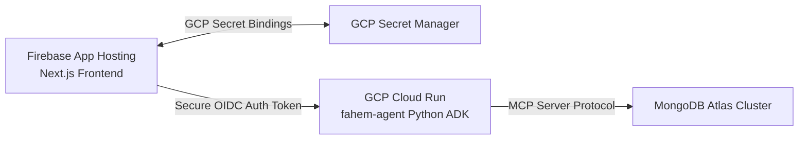

# Fahem Multi-Agent Database Orchestrator

Fahem (Arabic for "Comprehending") is a state-of-the-art, secure, multi-agent AI system designed for the **Google Cloud Rapid Agent Hackathon (MongoDB Track)**. It enables intuitive natural-language interactions over complex database schemas, aggregates, and collections. The project combines the **Google Agent Development Kit (ADK) in Python**, the **MongoDB Model Context Protocol (MCP) server**, and a stunning **Next.js (App Router) web application** hosted securely on **Firebase App Hosting**.

---

## 🌟 Visual Excellence & Premium Aesthetics
Fahem boasts a custom-crafted frontend designed to deliver an exceptional, premium user experience:
- **Cream Paper Theme**: A warm, responsive, and comfortable reading layout styled with pure Vanilla CSS, utilizing zero Tailwind frameworks.
- **Glassmorphic Accents**: Translucent navigation panels, smooth rounded user cards, and glass forms with subtle micro-animations and hover effects.
- **Responsive Dynamic Mirroring**: Supports complete Bidirectional (LTR/RTL) layout mirroring based on localized language selections, adjusting forms, layouts, and reading directions seamlessly.
- **Dynamic Floating Spheres**: Premium background interactive canvas with animated, floating glass spheres to elevate visual depth.

---

## 🏗️ Technical Architecture
Fahem utilizes a decoupled, zero-trust backend and serverless frontend architecture:



### 1. Web Frontend (`web/`)
- Built on the **Next.js App Router (TypeScript)** and deployed to **Firebase App Hosting** for seamless continuous integration and deployment (CD).
- Integrated with **Firebase Authentication** supporting official Google-branded Sign-In workflows.
- Implements two secure Node.js API routes:
  - `/api/db-metadata`: Queries the active MongoDB Atlas metadata natively in pure TypeScript using the high-performance `"mongodb"` driver.
  - `/api/agent`: Coordinates session-state validation, handles safety guardrails, retrieves secure GCP OIDC service-to-service Bearer tokens, and pipes the real-time agent output stream back to the dashboard.

### 2. Multi-Agent Microservice Backend (`agents/`)
- A containerized Python service deployed to **Google Cloud Run** in the `us-east4` region under the name `fahem-agent`.
- Built on the programmatic **Google Agent Development Kit (ADK) in Python**.
- Enforces strict private routing (`--no-allow-unauthenticated`), requiring secure, non-anonymous OIDC identity verification.
- Implements the **MongoDB Model Context Protocol (MCP) server** to execute collection schemas, multi-stage database aggregates, and structured database queries.

---

## 📁 Directory Structure & Roles

Here is an overview of the directory roles inside the Fahem workspace:

- **[agents/](file:///C:/Users/hesh1/Desktop/fahem/agents)**: Holds the Python ADK multi-agent workspace, including custom secure database tools (`secure_tools.py`), agent pipelines (`agent.py`), guardrails definitions (`guardrails.py`), and the Cloud Run container configuration (`Dockerfile`).
- **[web/](file:///C:/Users/hesh1/Desktop/fahem/web)**: Frontend assets, Next.js components, pages, global styling system (`globals.css`), and the serverless TypeScript API routes.
- **[security/](file:///C:/Users/hesh1/Desktop/fahem/security)**: Keeps versioned security policies, authorization frameworks, and general project-access controls.
- **[memory/](file:///C:/Users/hesh1/Desktop/fahem/memory)**: Tracks persistent project memories, plans, walkthroughs, tasks, progress, history, and active revisions.
- **[log/](file:///C:/Users/hesh1/Desktop/fahem/log)**: Chronological run diaries and interaction turn-by-turn logs (`turn_log.md`).
- **[scripts/](file:///C:/Users/hesh1/Desktop/fahem/scripts)**: Reusable python automation scripts, workspace setup scripts, and automated compliance sweeping engines.
- **[doc/](file:///C:/Users/hesh1/Desktop/fahem/doc)**: Technical manuals, MongoDB hackathon PDF resources, and generated compliance reports.
- **[scratches/](file:///C:/Users/hesh1/Desktop/fahem/scratches)**: Temporary scripts, playground tools, and scratch areas.

---

## 🛡️ Security Guardrails & Compliance Policies
Fahem implements a rigid, comprehensive security posture. For detailed specifications, refer to the **[security.md](file:///C:/Users/hesh1/Desktop/fahem/security.md)** file in the root.

1. **GCP Model Armor pre-flight filter**: Standard pre-filter protecting the system from prompt injection attacks and masking sensitive data.
2. **Identity-Gated Writes**: Database modifications (`insert`, `update`, `delete`, `drop`) are strictly blocked for unauthenticated users. If the global session context is absent, the write-gate dynamically extracts validated identities from tool arguments or nested documents.
3. **Credit-Based Quotas**: Rejects write operations once a user's active session credit balance is exhausted.
4. **No Direct PyMongo Mutations**: To prevent unauthorized mutations, all database writes are programmatically delegated through high-level parameterized MCP tools (such as `insert_user_report`) rather than direct client-side raw queries.
5. **Zero Plaintext Secret Exposures**: All credentials and API keys reside securely in **Google Cloud Secret Manager**. Modified files are scanned before Git commit to prevent leaks.

---

## 🚀 Quick Start & Installation

### Prerequisite Setup
Ensure you have **Python 3.11+**, **Node.js 18+**, and **Docker** installed.

### 1. Running the Next.js Frontend Locally
Navigate to the `web` folder, install dependencies, and spin up the local Next.js development server:
```bash
cd web
npm install
npm run dev
```
Open [http://localhost:3000](http://localhost:3000) in your browser.

### 2. Testing the Python ADK Agent Locally
The Python ADK workspace can be executed locally using the CLI runner script inside the `agents` folder:
```bash
# Navigate to the agents directory
cd agents

# Create and activate a virtual environment
python -m venv venv
venv\Scripts\activate   # On Windows
source venv/bin/activate # On Linux/macOS

# Install agent dependencies
pip install -r requirements.txt

# Run the agent with a custom prompt
python main.py "List the databases, list collections for 'fahem' database, and retrieve database stats."
```

### 3. Running the Automated Compliance Sweeper
Before staging or pushing changes to the remote GitHub repository, always run the automated compliance auditor to verify that your workspace contains no credential leaks or security findings:
```bash
python scripts/evaluate_compliance.py
```
A detailed markdown report will be generated and saved under the `doc/` folder.

---

## 📜 Development Guidelines & Turn Protocol

- **Append-Only Turn Log**: Document every interaction turn (including user prompts and response summaries) under the `log/turn_log.md` file. Do not delete or overwrite previous turn history.
- **Memory Versioning**: When introducing significant changes or completing task boards, create new versions of the plan (`plan_vXX.md`), tasks (`tasks_vXX.md`), and walkthrough (`walkthrough_vXX.md`) under the `memory/` folder to maintain clear progress tracking.
- **Committer Identity Enforcements**: All commits to the repository must originate from the authorized Git identity:
  - **Name**: `hesham88`
  - **Email**: `hesham1988@gmail.com`
