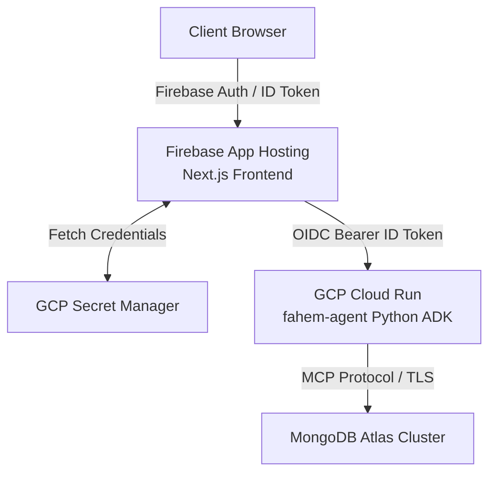
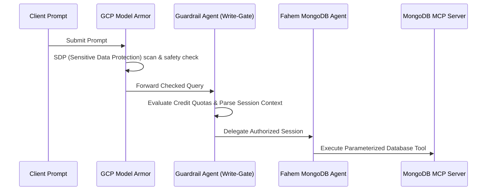
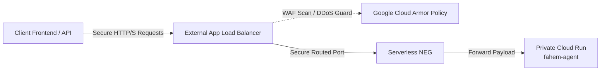

# Fahem Project - Security Architecture & Guardrails

This document outlines the security policies, authentication frameworks, data-protection mechanisms, and guardrail architectures implemented across the **Fahem** project. 

---

## 🛡️ Executive Security Summary
Fahem is a secure multi-agent database orchestrator built for the **Google Cloud Rapid Agent Hackathon (MongoDB Track)**. Due to the high sensitivity of direct database interactions, the project implements a zero-trust, multi-tiered security model that bridges stateless serverless Next.js hosts, OIDC-authenticated private Cloud Run compute resources, and the live MongoDB Atlas cluster.



---

## 🔒 1. Service Isolation & Authentication (OIDC)

### Private Microservices
The backend multi-agent service is containerized under the directory `agents/` and deployed to **Google Cloud Run** in the `us-east4` region under the name `fahem-agent`.
- **Access Control**: Enforces strict private routing via the `--no-allow-unauthenticated` IAM flag. Public, anonymous access is fully blocked.
- **Service-to-Service Communication**: The serverless Next.js API endpoint (`/api/agent`) authenticates itself to the private Cloud Run endpoint using standard Google OIDC (OpenID Connect) service identity Bearer ID tokens.
- **Dual-Token Retrieval Protocol**: To ensure high reliability under both Cloud environments and local development environments, `/api/agent` uses a dual OIDC retrieval strategy:
  1. **Primary**: Fetches the OIDC token from the GCP Metadata Server directly (optimized for production performance).
  2. **Fallback**: Utilizes the Google Auth Library (`google-auth-library`) to generate service account identities securely.

---

## 🛡️ 2. Native ADK Multi-Agent Guardrails

All incoming database prompts and execution steps are routed through the multi-agent security pipeline compiled in `agents/guardrails.py`.



### A. Google Cloud Model Armor Filter
Before the LLM processes any instructions, queries are validated against Google Cloud Model Armor:
- Blocks prompt injection attempts, adversarial attacks, and system instruction overrides.
- Implements Google Cloud Sensitive Data Protection (SDP) to mask credit cards, social security numbers, and credentials before execution.

### B. Identity-Gated Write Operations
To protect the integrity of database collections, all mutation operations (`insert`, `update`, `delete`, `drop`, `create`) are gated by strict cryptographic identity verification in the ADK `before_tool_callback` hooks:
- **Write Rejection**: Any database mutation request from an unauthenticated user or an empty session context is instantly blocked (`PermissionError`).
- **Dynamic Session Fallback**: In multi-tenant concurrent Cloud Run environments, if the global session state context is unpopulated, the write-gate dynamically extracts and validates the user's email directly from:
  - The tool's keyword arguments (`email`, `user_email`, `user_id`, `userId`).
  - Documents nested inside `insert-many` or update document payload dictionaries.
- **Credit-Based Quotas**: Tracks the active user session balance. If the balance falls to `0` credits, database write privileges are revoked, preventing excessive usage or denial-of-service loops.

---

## 🛡️ 3. Google Cloud Armor & Perimeter Security (WAF)

To defend our private multi-agent backend from distributed denial-of-service (DDoS) loops, malicious payload injections, and scanning bots, we deploy **Google Cloud Armor** on our edge perimeter.



- **Perimeter Web Application Firewall (WAF)**: An External HTTPS Load Balancer with a Serverless Network Endpoint Group (NEG) acts as our backend service entrypoint, protected by a global Google Cloud Armor security policy (`fahem-armor-policy`).
- **Preconfigured WAF Defenses**: Blocks top attack vectors natively using Google’s OWASP-compliant rules:
  - **SQL Injection (SQLi)**: `evaluatePreconfiguredExpr('sqli-v33-stable')`
  - **Cross-Site Scripting (XSS)**: `evaluatePreconfiguredExpr('xss-v33-stable')`
  - **Remote Code Execution (RCE)**: `evaluatePreconfiguredExpr('rce-v33-stable')`
  - **Local File Inclusion (LFI)**: `evaluatePreconfiguredExpr('lfi-v33-stable')`
- **Brute-Force Rate Limiting**: Restricts requests to **100 requests per minute** per client IP. If exceeded, further requests are blocked (`HTTP 429 Too Many Requests`) and the offending IP is temporarily banned for **5 minutes (300 seconds)**, protecting the agent model compute resource from malicious resource-exhaustion attacks.

---

## 🛠️ 4. Safe Database Operations (MCP Tool Compliance)

### No Raw PyMongo Mutations
To satisfy hackathon guidelines and enforce structural separation of concerns, the backend agent restricts direct database connections:
- **No Direct PyMongo Writing**: Database write operations are strictly prohibited inside the main agent script (`agents/agent.py`) using direct PyMongo clients.
- **Programmatic Delegation**: All database writes are programmatically delegated through high-level parameterized tools exposed by the private MongoDB MCP server.
- **Parameterized Mappings**: The `insert_user_report` tool in `agents/secure_tools.py` provides high-level schemas accepting specific safe keys (`name`, `email`, `subject`, `description`, `timestamp`). It dynamically maps parameters (`subject` -> `title`, `description` -> `content`) to match the legacy database schema while keeping inputs isolated and sanitized.
- **Safe Vector Operations**: No arbitrary mongo string execution. Insertions are compiled as document lists and routed strictly through the `insert-many` protocol.

---

## 🔑 5. Plaintext Secret Masking & Secret Manager

To guarantee zero exposure of credentials, the project follows strict secret management and masking procedures:
- **Google Cloud Secret Manager**: Production-level environment variables (including `MONGODB_URI`, `GEMINI_API_KEY`, and `FIREBASE_STORAGE_SECRET`) are secured in Secret Manager and mapped to private service configurations.
- **Local Environment Isolation**: Dev-time credentials reside exclusively in `web/.env.local` or `ignore/storage_secrets.json`. 
- **Git Version Controls**: The root `.gitignore` explicitly blocks all `.env.*` files, `ignore/` directory, and binary/executables (`agy.exe`) from being pushed to version control.
- **Plaintext Masking Policy**: All plan markdown documents, walkthrough logs, and turn files are strictly sanitized to use masked placeholders (e.g. `[MASKED_STORAGE_SECRET_URI]`) instead of plaintext values.

---

## 🔍 6. Automated Pre-Commit Compliance Sweeps

The project includes an automated python-based auditor script (`scripts/evaluate_compliance.py`) that executes pre-commit validation before files are pushed to production:
- **Git Identity Validation**: Verifies that the local git repository user configuration matches the authorized committer credentials:
  - **Name**: `hesham88`
  - **Email**: `hesham1988@gmail.com`
- **Secrets Audit**: Scans all modified and new files for plaintext credentials, database URLs, API keys, or unauthorized file paths.
- **Exclusivity Check**: Audits files for unauthorized competitor terms or libraries to ensure 100% Google Cloud/MongoDB compliance.
- **Report Generation**: Automatically compiles the compliance audit results into dated reports under the `doc/` directory.

---

## 🚀 7. Developer Guidelines

To maintain the security posture of the project:
1. **Never use direct MongoDB write commands** in custom scripts. Always wrap database mutations in high-level parameterized ADK tools.
2. **Never commit `.env` or configuration files** containing plaintext keys. Add them to `.gitignore` and bind them to Google Cloud Secret Manager instead.
3. **Execute the compliance auditor before pushing to GitHub**:
   ```powershell
   python scripts/evaluate_compliance.py
   ```
4. **Ensure all changes are pushed from the authorized Git identity** to guarantee CI/CD deployment compliance.
