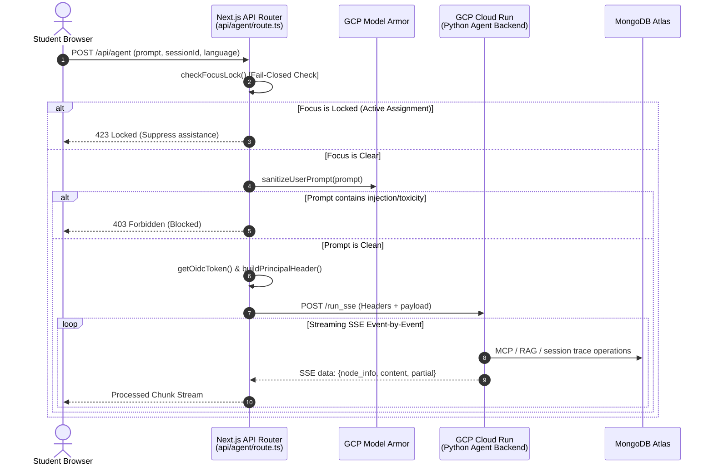

<!-- BEGIN:nextjs-agent-rules -->
# This is NOT the Next.js you know

This version has breaking changes — APIs, conventions, and file structure may all differ from your training data. Read the relevant guide in `node_modules/next/dist/docs/` before writing any code. Heed deprecation notices.
<!-- END:nextjs-agent-rules -->

---

# 🔗 Frontend-to-Agent Integration Protocol

This document serves as the technical guide for developers and AI agents working on the integration layer between the **Next.js frontend** and the **Python ADK 2.0 multi-agent backend**. It outlines how requests are structured, secured, streamed, and parsed in real time.

---

## 🛠️ API Routing & Security Posture (`src/app/api/agent/route.ts`)

The central integration route is `POST /api/agent`. This route accepts user queries, validates credentials, sanitizes input, and streams responses from the Cloud Run agent.



### 1. Security & Identity Handshakes
To prevent unauthorized API access, requests to the Cloud Run backend are signed and authorized:
* **OIDC Identity Token**: Inside `getOidcToken()`, the API route requests a signed Google OIDC token on behalf of the hosting service or active credentials to satisfy Cloud Run's strict `--no-allow-unauthenticated` private routing.
* **Verified Principal Header (`X-Verified-Principal`)**:
  To forward authenticated identity profiles securely, the API route injects an encrypted or structure-mapped header mapping to standard rules:
  ```json
  {
    "uid": "user_id_here",
    "email": "student@fahem.ai",
    "role": "student",
    "db_target": "fahem",
    "selected_book_ids": [],
    "selected_text": "text highlighted in UI",
    "book_id": "book_physics_101",
    "page": 24
  }
  ```
  *(Matches compliance rules under `guard:allow-principal`)*.

---

## 📡 SSE (Server-Sent Events) Streaming Protocol

The API streams agent outputs directly to the client browser using a standard SSE stream reader to provide instant feedback and system log visibility.

### 1. Metadata Directives
At the beginning of the stream, and during execution transitions, the API enqueues specific metadata prefixes that the frontend UI parses to update the app state:
* `[METADATA] SessionId: <session-id>`: Syncs the active workspace session.
* `[METADATA] ActiveAgent: <node-path>`: Instructs the frontend to update the active agent indicator (e.g. "Onboarding Agent", "Academic Agent", "Quiz Agent").
* `[Fahem Agent] [SYSTEM LOG] <log>`: Live log entries showing agent tool invocations (e.g. running a search, querying the DB) rendered in a collapsible diagnostic console for students.

### 2. Stream Sanitization
During stream processing, the API runs `cleanFabricatedUrls()` over chunks to strip out any hallucinated external hyperlinks created by the model, keeping textbook environments safe and localized.

---

## ⌨️ Autocomplete & Macro Routing Engine

To enhance interactions, the frontend UI features an autocomplete input bar. The Orchestrator Agent (`fahem_companion`) processes these specialized inputs:

* **`@` Subject Route Filter**:
  Allows students to route prompts directly to specific curriculum subjects (e.g., typing `@math how do I solve quadratic equations`). The orchestrator instantly assigns the Academic Agent and locks context to the math syllabus.
* **`#` Textbook & Scope Controller**:
  Allows students to scope questions to specific sections or book structures (e.g., `#chapter-2` or `#book_physics_101`). This scopes the Academic Agent's `rag_tool` search queries to avoid general database spillover.
* **`/` Macro Command Actions**:
  Quick-action controllers that bypass conversational steps:
  - `/practice`: Dispatches the student immediately to a dynamic quiz.
  - `/summarize`: Tells the Academic Agent to synthesize current page.
  - `/plan`: Requests a customized study guide based on telemetry gaps.

---

## 🔗 Interactive Cite-Linking Engine

To create a cohesive, side-by-side reading and chatting environment, we use a custom parsing protocol:

1. **Backend Citation Token**: When the Academic Agent locates content from a textbook, it formats citations strictly as:
   ```
   [book_id:pPageNum]
   Example: [book_intro_python:p24]
   ```
2. **Frontend Interceptor**:
   - The React markdown parser on the frontend scans messages for the bracket pattern `\[([a-zA-Z0-9_-]+):p([0-9]+)\]`.
   - Instead of displaying a static bracket, it dynamically renders a clickable **Next.js Anchor Component**.
   - Clicking this citation dispatches a globally bound event (via React Context), triggering the split-screen **Interactive Reading Room** to slide open and scroll the PDF frame immediately to page 24 of the book `book_intro_python`.
